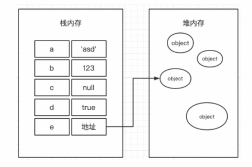

# JS / ES6 学习笔记

##### js 三大部分：

- ECMA Script 语法标准
- DOM 通过文档模型 dom 操作网页
- BOM 通过浏览器模型 bom 操作浏览器

##### 解释/编译：

- 解释：翻译一行执行一行，不产生编译文件。
  - 解释的时候需要解释环境，运行慢。
  - 有解释环境就行，可以执行好。
  - js python
- 编译：生成编译文件在执行。
  - 速度快，代码效率高，保密性好。
  - 可以执行差
  - c++

##### js 特点：

- 单线程：与用户互动、操作 DOM
- .css .js 分离 使用外部引入
- 变量提升：将变量的声明提到前面。

##### 栈内存 / 堆内存：

&emsp;Js 分为栈内存和堆内存。栈内存用来存放基础类型的数据 number boolean string null symbol undefined，堆内存存放复杂类型：对象、数组。


##### var let const

- var：函数作用域
- let：块级作用域。没有变量提升。暂时性死区（声明前不可用）。
- const：同 let。变量声明的同时立即赋值。如果是简单类型则不可改变。

```js
if (true) {
  var a = 0;
  const b = 1;
  let c = 2;
}
//a为0; b/c is not defined
console.log(a, b, c);
```

##### Symbol（没完全理解）

- 原始类型数据：Number String Boolean Null Undefined Symbol
- 复杂类型数据：Object

&emsp;&emsp;对象的属性名容易产生命名冲突，为保证键名的唯一性，故 es6 引入 Symbol 这种新的原始类型数据，确保创建的每个变量都是独一无二的。
&emsp;&emsp;也可以用来定义常量。
&emsp;&emsp;由于 Symbol 函数返回的值是原始类型的数据，不是对象，故 Symbol 函数前不能使用 new 命令，否则会报错。

```js
let school1 = Symbol('bjut');
let school2 = Symbol('bjut');
console.log(school1 === school2); //false
```

##### 解构复制

&emsp;&emsp;可以理解为赋值操作的语法糖。对数组或对象进行模式匹配，然后对其中的变量进行赋值。

- 数组解构
  ```javascript
  let [a, b, c = 6] = [1, 2]; //变量赋值及默认值
  let [a, ...other] = [1, 2, 3]; //分割数组 other[2,3]
  ```
- 对象解构
  ```javascript
  //var1 = '123' var2 = 123
  let { property1: var1, property2: var2 } = { property1: '123', property2: 123 };
  ```
- 读取接口返回的数据
  ```javascript
  function xd() {
    return {
      name: 'xdclass',
      wangzhi: [
        {
          url: 'xdclass.net',
        },
      ],
    };
  }
  let {
    name,
    wangzhi: [{ url }],
  } = xd();
  ```

##### 扩展运算符 `...`

- 扩展数组
  - 深拷贝一维数组（不能深拷贝二维数组）
    ```javascript
    const list = [1, 2, 3, 4, 5];
    const list_new = [...list];
    ```
  - 分割数组
    ```javascript
    const list = [1, 2, 3, 4, 5];
    const [a, , ...list_new] = list;
    //list_new [3,4,5]
    ```
  - 将数组转化成参数传递给函数
    ```javascript
      const list = [1,2];
      function xd(a,b) {
        ...
      }
      xd(...list);
    ```
- 扩展对象
  - 深拷贝简单对象 `const b = {..a}`
  - 与解构赋值配合
    ```js
    let object = { a: '1', b: '2', c: '3', d: '4' };
    let { a, b, ...other } = object; //object {c: '3', d: '4'}
    ```
  - 合并对象
    ```js
    const a = {aa:1, bb:2};
    const b = {cc:3, dd:4};
    const c = {..a, ..b}; //c {aa:1, bb:2, cc:3, dd:4}
    ```
- find findIndex 函数（返回子项）
  ```js
  const list = [
    { name: 'zs', age: 10 },
    { name: 'ls', age: 11 },
    { name: 'ww', age: 12 },
    { name: 'zl', age: 10 },
  ];
  //此处返回的不是boolean值，而是找到的第一个满足条件的对象
  const result = list.find((item) => {
    return item.age === 10;
  });
  //也可以简写为
  const result2 = list.find((item) => item.age === 10);
  ```
- filter 函数（返回数组）
  ```js
  //此处返回的不是boolean，而是一个新的对象数组
  const result = list.filter((item) => {
    return item.age === 10;
  });
  ```

##### map 方法

- map
  ```js
  //返回一个新的对象数组，其中的每个对象就是return{}中的内容
  const list_new = list.map(function (item) {
    return {
      id: item.name,
      age_state: item.age <= 18 ? '未成年' : '成年人',
    };
  });
  ```
- 对象的深拷贝
  ```js
  const i = { a: 123, b: '123' };
  let obj = {};
  Object.assign(obj, i);
  ```

##### 属性、方法的简写

```js
ES5           ------>         ES6
let obj = {                   let obj={
  name: name,                   name,
  age: age,                     obj,
  sayHello(): function(){       sayHello(){
    ...                           ...
  }                             }
}                             }
```

##### Object 方法

```js
Object.is(a, b) 代替===符号的写法。唯一的不同是，NaN===NaN会判断为false，而Object.is(NaN, NaN)会返回true。
Object.assign(target,  source) 把source对象传入target对象.
Object.keys(object) 返回一个包含所有属性的数组
Object.values(object) 返回一个包含所有属性值的数组
Object.entries(object) 把对象变为数组 //[['name','wzt'],['age',18],['address',1513]]
```

##### Map WeakMap 对象

&emsp;&emsp;**js 中的对象，实质就是键值对的集合**。但是在对象里只能使用字符串作为键名。因此，Map 对象被提出了，它是 js 中一种更完善的 Hash 结构。

```js
const map = new Map([
  ['name1', 'zhangsan'],
  [3.14159, 'pai'],
  [undefined, 123],
])
map.size() //键值对的数量
map.clear() //清空Map
map.has(key)  //是否有指定的键名，返回Boolean
map.get(key)  //获取指定键名的键值，没有则返回undefined
map.set(key, value) //添加键值对
map.delete(key) //删除指定键名的键值对
map.keys() map.values() map.entries() //同Object
```

&emsp;&emsp;**WeakMap 对象**。键名只能是对象，不能是字符串、数值。

```js
const weakMap = new WeakMap([document.getElementById('test'), element]);
```

##### Set WeakSet 结构

&emsp;&emsp;Set 是一种类似数组的数据结构，可以理解为值的集合。它的值不会有重复项。

```js
const list = new Set([1, 2, 3, 4]);
list.keys() === list.values(); //key value相等

let arr = [1, 2, 3, 3, 3, 3, 4, 5];
let set = new Set(arr); //数组的去重
```

&emsp;&emsp;WeakMap 结构不可遍历。因为它的成员都是对象的弱引用，随时被回收机制回收，成员消失。

##### 类型转换

```js
//对象转Map
const obj = { school: 'BJUT', class: '814' };
const map = new Map(obj.entries());
//Map转对象
const obj = Object.fromEntries(map);
//数组转Set
const list = [1, 2, 3];
const set = new Set(list);
//Set转数组
const list = Array.from(set);
```

##### Proxy Reflect（没完全理解）

&emsp;&emsp;Proxy 不直接作用在对象上，而是作为一种媒介。如果需要操作对象的话，需要经过这个媒介的同意。

```js
const house = {
  name: '张三',
  price: '1000',
  phone: '18823139921',
  id: '111',
  state: '**',
};

const houseProxy = new Proxy(house, {
  // 读取代理
  get: function (target, key) {
    switch (key) {
      case 'price':
        return target[key].replace('1000', '1200');
      case 'phone':
        return target[key].substring(0, 3) + '****' + target[key].substring(7);
      default:
        return target[key];
    }
  },
  // 设置代理
  set: function (target, key, value) {
    if (key === 'id') {
      return target[key];
    } else if (key === 'state') {
      return (target[key] = value);
    }
  },
});
```

Reflect 没有仔细讲，我暂时没理解。

##### 使用 Proxy 实现简单的双向数据绑定

```js
const input = document.getElementById('input');
const span = document.getElementById('span');

const obj = {};
const handler = {
  get: function (target, key) {
    return target[key];
  },
  set: function (target, key, value) {
    if (key === 'text' && value) {
      //将js对象中的改变绑定到html组件中
      span.innerHTML = value;
      return (target[key] = value);
    }
  },
};
const inputProxy = new Proxy(obj, handler);

input.addEventListener('keyup', function (e) {
  //"keyup"为获取键盘输入
  //将html组件中的改变绑定到js对象中
  inputProxy.text = e.target.value; //获取键盘输入
  console.log(inputProxy.text);
});
```
