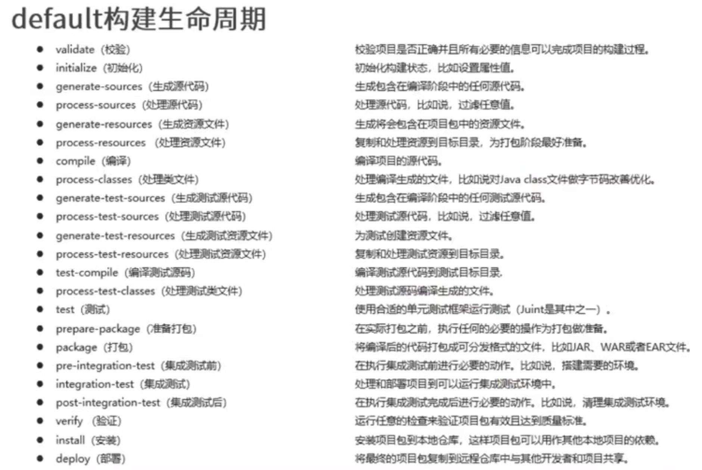

# Maven

## 介绍

项目管理工具，将项目开发和管理过程抽象成一个项目对象模型（POM）Project Object Model

Maven 作用：

- 项目构建：提供标准的、跨平台的自动化项目构建方式
  `构建生命周期 Build lifecycle & phases <---> 插件 ---> jar包、源代码、帮助文档、war包、XML`
- 依赖管理：管理项目依赖的资源（jar 包），避免资源间的版本冲突问题 pom.xml 文件记录项目信息:
  `pom.xml ---> 项目对象模型 <---> 依赖管理Dependency ---> 本地仓库 ---> 私服仓库 ---> 中央仓库`
  中间的双向箭头表示：

  - Dependency 管理项目用到的资源
  - 项目本身也可以变成资源，被别人用

  仓库：

  - 本地仓库
  - 私服仓库存公共资源 最终依赖的资源都来自中央仓库

- 统一开发结构：标准的项目结构

## Maven 目录

目录：

- bin 核心运行文件
- boot 类加载器 jar 包
- conf Maven 配置文件：settings.xml
- lib Maven 运行所依赖的 jar 包。Maven 也是 java 写的

环境变量 `export PATH=$PATH:~/apache-maven-3.5.4-bin/bin`

## 三级仓库

仓库：储存资源，包括各种 jar 包

- 本地仓库 自己电脑上储存资源的仓库
- 私服
  - 对内部共享资源，不对外共享。例如公司的私服从中央仓库拉取资源（资源多且访问速度慢），程序员从私服拉取资源（资源少且访问速度快）。
  - 保存具有知识产权的资源
- 中央仓库
  - Maven 团队维护，开源的资源
  - 最终依赖的资源都来自中央仓库

查资源：mvnrepository.com

### 坐标

坐标：描述仓库中资源的位置

- groupId: 组织名（通常是域名反写 org.mybatis）
- artifactId: 项目名称（通常是模块名称）
- version
- packaging：打包方式

```xml
  <dependency>
    <groupId>log4j</groupId>
    <artifactId>log4j</artifactId>
    <version>1.2.17<version>
  </dependency>
```

### 自定义 Maven 设置

修改：maven 文件夹/conf/settings.xml

- 配置本地仓库位置，没有则默认在：主文件夹/.m2/repository
  `<localRepository>/path/to/local/repo</localRepository>`
- 配置镜像

  ```xml
    <mirrors>
      <mirror>
        <!-- id, 用来区分mirror -->
        <id>nexus-aliyun</id>

        <!-- 对哪个仓库进行镜像， -->
        <!-- central（中央仓库） *（所有远程仓库） -->
        <mirrorOf>*</mirrorOf>

        <!-- 镜像名称 -->
        <name>Nexus aliyun</name>

        <!-- url -->
        <url> ... </url>
      </mirror>
    </mirrors>
  ```

### 常用指令

- mvn compile
  - 下载依赖文件，编译，存到 target 文件夹中
- mvn clean
  - 清理 target 文件夹
- mvn test
  - 运行测试，结果在 target/surefire-reports/ 文件夹中，有一个 xml 文档，存储了运行环境信息和测试用例的结果
- mvn package
  - 打包：会执行一串指令，compile、testCompile、test、最后打包
- mvn install
  - 把项目打包放到 Maven 仓库中

### 依赖管理

直接依赖：dependency 里面写的
间接依赖：依赖的资源依赖其他资源

依赖冲突：大家依赖的版本不一样

- 路径优先：层级越浅，即离顶层近，优先级越高
- 声明优先：同层级，配置顺序考前的覆盖靠后的
- 特殊优先：同级配置了相同资源的不同版本，后配置的覆盖前配置的（少见）

可选依赖：对外隐藏当前所依赖的资源，写在自己的 pom 文件里，别人在使用你的资源时看不到间接依赖

```xml
  <dependency>
    groupId artifactId version ...
    <optional>true<optional>
  </dependency>
```

排除依赖：主动告诉 Maven 在解析依赖树时，完全跳过并忽略指定的间接依赖。这个被排除的依赖既不会被下载到你的本地仓库，也不会被加入项目的类路径（classpath）

```xml
  <dependency>
    <groupId>com.example</groupId>
    <artifactId>project-B</artifactId>
    <version>1.0.0</version>
    <exclusions>
        <exclusion>
            <!-- 指定要排除的依赖的groupId和artifactId -->
            <groupId>com.example</groupId>
            <artifactId>unwanted-project-C</artifactId>
        </exclusion>
    </exclusions>
  </dependency>
```

#### 依赖范围

依赖的 jar 默认情况可以在任何地方使用，可通过 scope 标签设定其作用范围

- 主程序范围有效 main
- 测试程序范围有效 test
- 是否参与打包 package
  

### 生命周期 & 插件

大体分类：compile --> test compile --> test --> package --> install

项目构建生命周期，共三种：

- clean: 清理 `pre-clean --> clean --> post-clean`
- site: 生产报告、发布 `pre-site --> site --> post-site --> site-deploy`
- default：
  
  每一条称为一个阶段 **phase**

**插件**与生命周期内的阶段绑定，在执行到对应生命周期时执行对应的插件功能

- maven 给插件绑定预设的功能
- 也可以自定义其他功能
