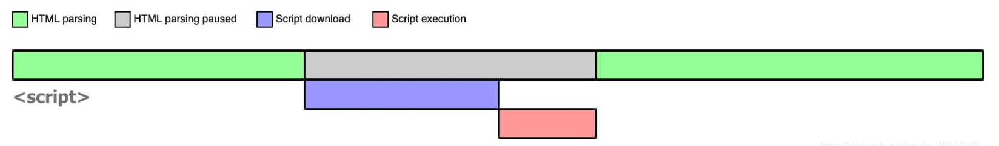
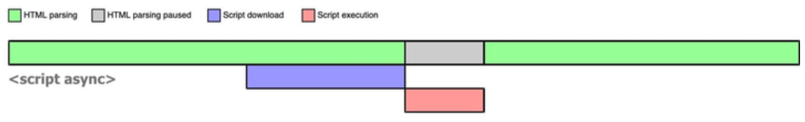
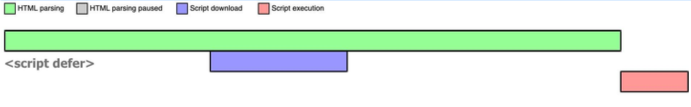
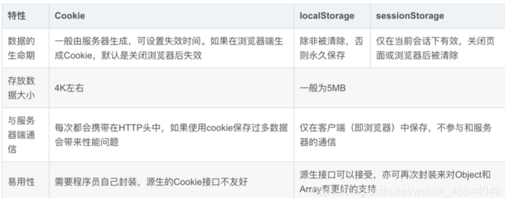

# HTML 学习笔记

##### HTML & XML

HTML:HyperText Markup Language / 超文本标记语言 / 用来显示数据 / 除了文本，还能标记其他内容
XML:Extensible Markup Language / 可扩展标记语言 / 用来传输和存储数据 / 纯文本而已

##### DOCTYPE（document type）

告诉浏览器当前 HTML 是用什么版本编写的，应该使用什么样的文档类型定义（DTD）来解析。
HTML4：`<!DOCTYPE HTML PUBLIC "-//W3C//DTD HTML 4.01 Transitional//EN"
"http://www.w3.org/TR/html4/loose.dtd">`
HTML5：`<!DOCTYPE html>`

##### 语义化

语义元素清楚地向浏览器和开发者描述其意义。
非语义元素的例子：`
 ` - 无法提供关于其内容的信息。
语义元素的例子：`<form> <table> ` 清晰地定义其内容。

- 为什么要语义化
  - 代码结构: 使页面没有 css 的情况下，也能够呈现出很好的内容结构
  - 有利于 SEO: 爬虫依赖标签来确定关键字的权重，因此可以和搜索引擎建立良好的沟通
  - 提升用户体验： 例如 title、alt 可以用于解释名称或者解释图片信息，以及 label 标签的灵活运用。
  - 便于团队开发和维护: 语义化使得代码更具有可读性。
  - 方便其他设备解析: 如屏幕阅读器、盲人阅读器、移动设备等，以有意义的方式来渲染网页。
- 切片元素：**HTML5** 提供了新的语义元素来定义网页的不同部分
  <image src="images/2024-03-19-16-19-48.png" style="zoom:25%;"/>

##### href 和 src 的区别

- herf Hypertext Reference

  - 表示超文本引用，**指向网络资源的所在位置**，用来建立当前文档和引用资源的联系。
  - 浏览器会识别该文档为 css 文档，并行下载该文档，并且不会停止对当前文档的处理，这也是在文档中不使用 @import 的原因。
    `<link href="./style.css" rel="stylesheet" />`
    `<a href="https://xdclass.net" />`

- src source
  - 引用资源（js 脚本、图片），将目标资源**下载**应用到当前文档。
  - 当浏览器解析到该元素时，会暂停浏览器的渲染，直到该资源加载完毕，这也是 js 脚本放到 body 最下方的原因。
    ``

##### srcset

img 元素的 srcset 属性用于浏览器根据宽、高和像素密度来加载相应的图片资源。
``
浏览器宽度达到 800px 则加载 middle.jpg ，达到 1400px 则加载 big.jpg

##### css 的 link 标签放在头部，js 的 script 放在 body 底部

- link 标签放在 head 标签中
  - 用户访问网站时，代码是从上往下解析的，正常展示页面内容的样式，提高用户体验。这样浏览器一边下载 html 构建 DOM 树，一边下载 css 构建 css 树（style rules），然后两个合成为渲染树（render tree），然后展示给用户。
  - 放在 html 结构底部时，加载页面会出现 html 结构混乱的情况。
- script 标签放在 body 结束标签之前
  - JS 脚本在下载和执行期间会阻止 html 解析
  - 把 script 标签放在底部，保证 html 和 css 首先完成解析之后再加载 JS 脚本。
  - script 标签加上 **defer**（推迟的意思）属性时，可以放在 head 标签中 （async）

##### defer 和 async

- 浏览器在解析 HTML 的时候，如果遇到一个没有任何属性的 script 标签，就会暂停解析，先发送网络请求获取该 JS 脚本的代码内容，然后让 JS 引擎执行该代码，当代码执行完毕后恢复解析。
  
- 当浏览器遇到带有 async 属性的 script 时，请求该脚本的网络请求是异步的，不会阻塞浏览器解析 HTML，一旦网络请求回来之后，如果此时 HTML 还没有解析完，浏览器会暂停解析，先让 JS 引擎执行代码，执行完毕后再进行解析，图示如下：
  
  当然，如果在 JS 脚本请求回来之前，HTML 已经解析完毕了，那就立即执行 JS 代码：
  <image src="images/2024-03-19-17-04-09.png" style="height:100px;"/>
  所以 async 是不可控的，因为执行时间不确定。如果在异步 JS 脚本中获取某个 DOM 元素，有可能获取到也有可能获取不到。而且如果存在多个 async 的时候，它们之间的执行顺序也不确定，完全依赖于网络传输结果，谁先到执行谁。这导致 async 属性下的脚本是乱序的，对于 script 有先后依赖关系的情况，并不适用。

- 当浏览器遇到带有 defer 属性的 script 时，获取该脚本的网络请求也是异步的，不会阻塞浏览器解析 HTML，一旦网络请求回来之后，如果此时 HTML 还没有解析完，浏览器不会暂停解析并执行 JS 代码，而是等待 HTML 解析完毕再执行 JS 代码。
  

##### 提高搜索权重 SEO

- 详见大课笔记

- TDK：title、description、keywords
- 提高网站语义化的 html 标签占比
  `<a>、
、<ul>、<ol>、<li>、<h1>、<h2>、<h3>...`
  无语义化的标签`
、`
- 服务端渲染

##### viewport

- 如何在不同移动设备的屏幕下正常展示网页的内容？
  考点：meta 标签 viewport 属性
  <image src="images/2024-03-15-01-07-33.png" style="zoom:30%;"/>
- 手机浏览器会把页面放入到一个虚拟的视口（viewpoint）中，但 viewport 又不局限于浏览器可视区域的大小，它可能比浏览器的可视区域大，也可能比浏览器的可视区域小。通常这个虚拟的视口（viewport）比屏幕宽，会把网页挤到一个很小的窗口。
  `<meta name="viewport" content="width=device-width,initial-scale=1,maximum-scale=1,minimum-scale=1,user-scalable=no" />`

##### DOM BOM

- DOM 就是⽂档对象模型，是⼀个抽象的概念。定义了访问和操作 HTML ⽂档的⽅法和属性。
- BOM 就是浏览器对象模型，内置对象定义操作浏览器的方法。

##### cookie localStorage sessionStorage

- cookie：在 HTML5 标准前本地储存的主要方式。优点是兼容性好，缺点是大小只有 4k，自动请求头加入 cookie 浪费流量，使用起来麻烦需要自行封装。
- sessionStorage 用于临时保存同一窗口(或标签页)的数据，在关闭窗口或标签页之后将会删除这些数据，在浏览器打开期间存在，包括页面重新加载。
- localStorage 用于长久保存整个网站的数据，保存的数据没有过期时间，直到手动去除。
  

