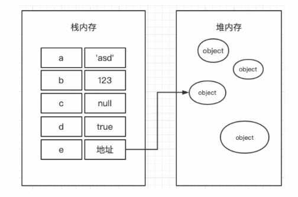
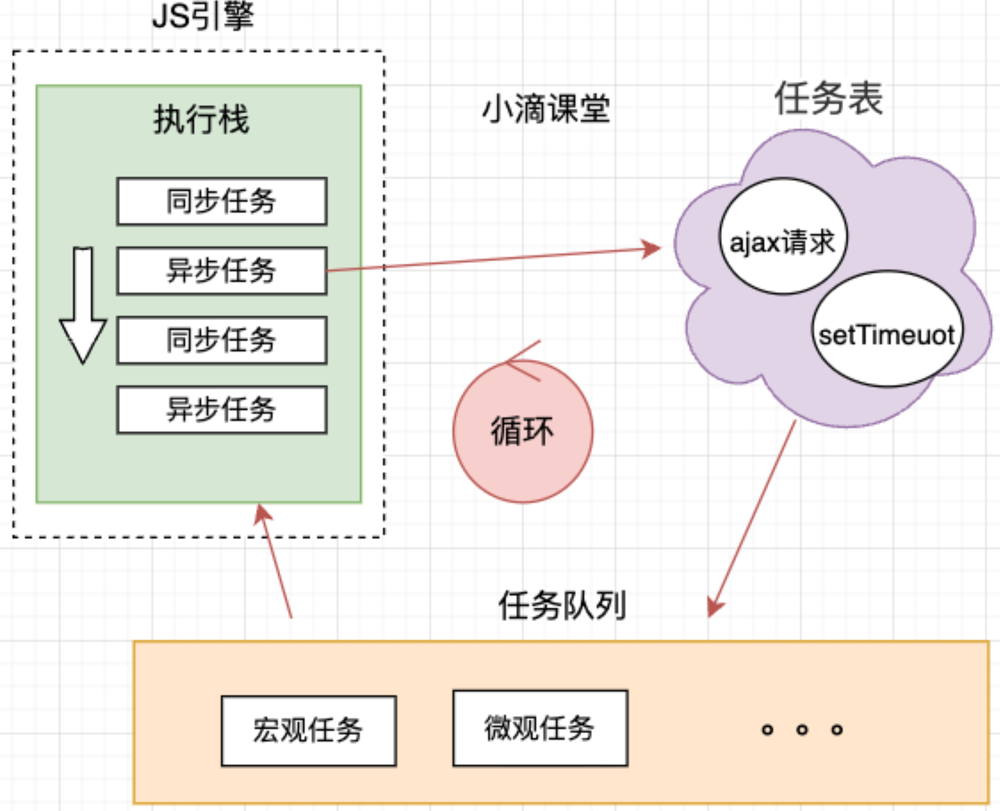
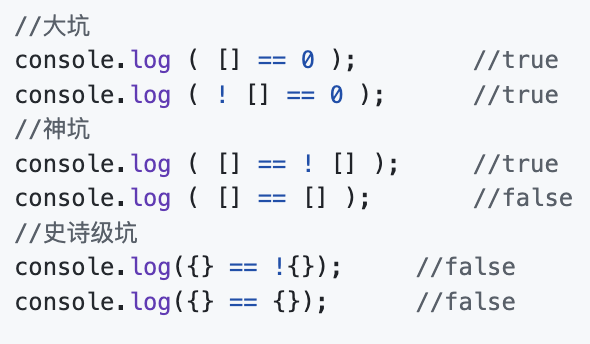
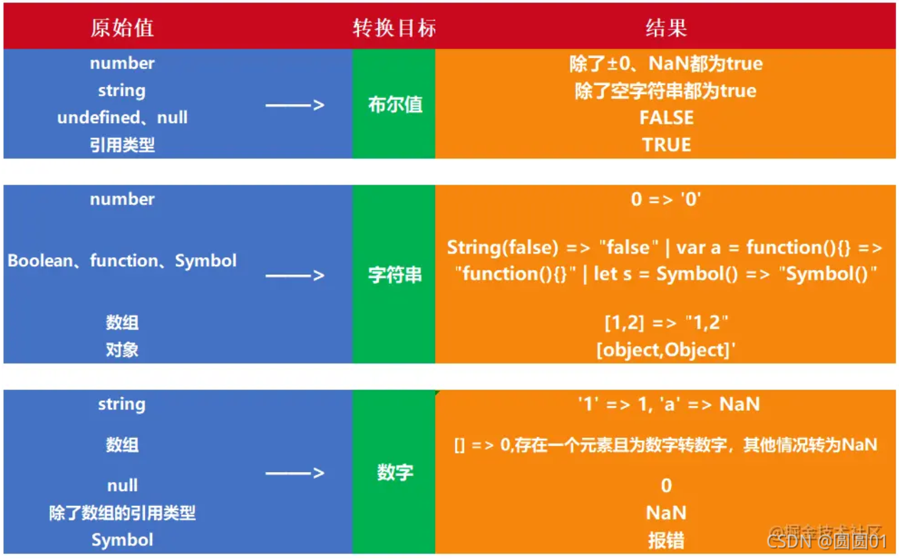
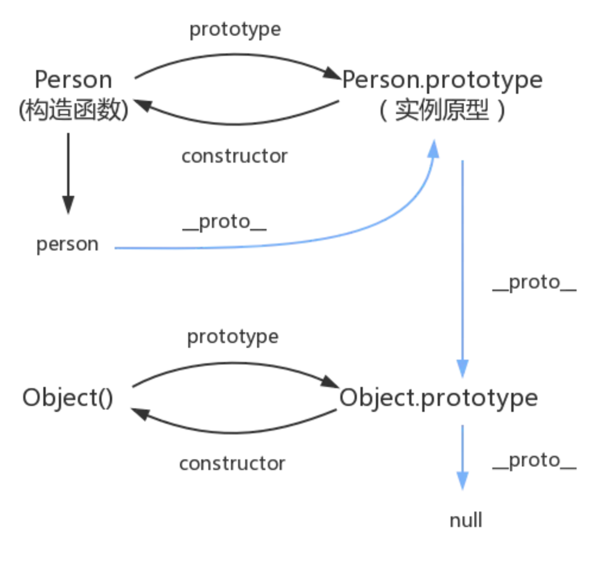

# JS / ES6 学习笔记

##### js 三大部分：

- ECMA Script 语法标准
- DOM 通过文档模型 dom 操作网页
- BOM 通过浏览器模型 bom 操作浏览器

##### 解释/编译：

- 解释：翻译一行执行一行，不产生编译文件。
  - 解释的时候需要解释环境，运行慢。
  - 有解释环境就行，可以执行好。
  - js python
- 编译：生成编译文件在执行。
  - 速度快，代码效率高，保密性好。
  - 可以执行差
  - c++

##### js 特点：

- 单线程：与用户互动、操作 DOM
- .css .js 分离 使用外部引入
- 变量提升：将变量的声明提到前面。

##### 栈内存 / 堆内存：

&emsp;Js 分为栈内存和堆内存。栈内存用来存放基础类型的数据（也叫原始值） number boolean string null symbol undefined，堆内存存放复杂类型（也叫引用值）：对象。


- 复制值的时候，原始值的两个变量互不干扰`let num1 = 5,num2 = num1`
- 复制值的时候，引用值复制的实际上是一个指针，指向存储在堆内存中的对象。操作完成后，两个变量实际上指向同一个对象。

##### JS 的事件循环

- js 是一门单线程的非阻塞的脚本语言。
- **单线程**：如果有两个线程同时对同一个 DOM 进行操作，一个是在这个 DOM 上绑定事件，另外一个是删除该 DOM，此时就会产生歧义。因此 JS 以单线程来执行代码，保证一致性。
- **非阻塞**：当 JS 代码从上往下执行，遇到需要进行一项异步任务的时候，主线程会挂起这个任务，继续往下执行代码，然后在异步任务返回结果的时候再根据一定规则去执行。
  
- 异步任务分类：宏任务（setTimeout），微任务（promise）
- 所有同步任务都在主线程上执行，形成一个执行栈
- 遇到异步任务放到任务表中，等事件执行完成（ajax 请求完成、setTimeout 设置时间到期），之后放入到任务队列
- 当执行栈的同步任务执行完成之后，就会执行任务队列的第一个异步任务，其中把宏观任务和微观任务都执行完成后才进行下一次循环。

###### 函数传递参数

- 所有函数都是按值传递的。函数外部的值会被复制到函数内部的参数中。这样，函数外部的参数和函数内部的参数都指向同一个对象。所以，在函数内修改对象中的内容，会影响函数外部。
- 但是当函数内部的参数被重新定义为一个新的对象时`obj = new Object()`，他实际上就指向了一个新的 object。而函数外的变量依旧指向原来的 object，不会被影响。
- 这说明对象在函数中也是按值传递的，而不是按引用传递。

##### 执行上下文栈和作用域链

- 执行上下文就是当前 JavaScript 代码被解析和执行时所在环境, JS 执行上下文栈可以认为是一个存储函数调用的栈结构。
- 当一段 JavaScript 代码在运行的时候，它实际上是运行在执行上下文中。

  - JavaScript 执行在单线程上，所有的代码都是排队执行。
  - 浏览器执行全局的代码时，首先创建全局的执行上下文，压入执行栈的顶部。
  - 每个函数会在执行的时候创建自己的执行上下文，并且把它压入执行栈的顶部。这个上下文就是
  - 通常说的 “本地上下文”。当前函数执行完毕并退出的时候，其上下文也从栈中弹出并销毁。
  - 主程序退出，全局执行上下文从执行栈中弹出。此时栈中所有的上下文都已经弹出，程序执行完毕。

- 作用域链
  函数执行所需要的变量在当前作用域中找不到的时候，它就会一层一层向上查找，一直找到全局作用域。这种一层一层的关系，就是作用域链。

##### new

- 创建了新空对象
- 新对象的`\_\_proto\_\_ = 构造函数.prototype`
- 将构造函数的作用域赋值给新对象(this 指向新对象)
- 执行构造函数代码 （为这个新对象添加属性）
- 返回新对象

```js
function Student(obj) {
  // this={};
  this.name = obj.name;
  this.score = obj.score;
  this.grade = obj.grade;
  // return this;
}
var a = new Student({ name: '1', score: '2', grade: '3' });
```

##### var let const

- var：函数作用域。 有变量提升。
- let：块级作用域。没有变量提升，即暂时性死区（声明前不可用）。
- const：同 let。变量声明的同时立即赋值。如果是简单类型则不可改变。

```js
if (true) {
  var a = 0;
  const b = 1;
  let c = 2;
}
//a为0; b/c is not defined
console.log(a, b, c);
```

##### 数据类型

- 原始类型数据：Number String Boolean Null Undefined Symbol
- 复杂类型数据：Object

- Undefined：没初始化的变量就是 undefined。undefended 唯一有用的事情就是 typeof。有意思的是，没声明和没初始化的变量都`typeof == undefined`。
- null：表示一个空指针对象，`typeof null == object`。有趣的是，`null == undefined`。
- number：
  - 浮点数
    ```js
    //由于浮点数的精度高达17位，在计算中很不精准。
    //例如a=0.1，b=0.2，c却可能是0.30000000000004
    if (a + b == 0.3) {
      console.log('0.3');
    }
    ```
  - NaN `NaN == NAN 结果为false`变量
    `isNaN(NaN)`或者`isNaN(转换不成数字的)`返回值为 true
  - Infinity `5/0会返回Infinity 5/-0会返回-Infinity`
  - `Number(null) == 0` `Number(undefined) == NaN`
  - parseInt() parseFloat()较 Number()更为常用。如果第一个非空格字符不是数字、加减号，则直接返回 NaN。因此`parseInt(null) == NaN`，与 Number()不同。
- String
  - 模板字面量 + 字符串插值 \`${var1}\`
- Symbol：对象的属性名容易产生命名冲突，为保证键名的唯一性，故 es6 引入 Symbol 这种新的原始类型数据，确保创建的每个变量都是独一无二的。
  ```js
  let school1 = Symbol('bjut');
  let school2 = Symbol('bjut');
  console.log(school1 === school2); //false
  ```
  - 由于 Symbol 函数返回的值是原始类型的数据，不是对象，故 Symbol 函数前不能使用 new 命令，否则会报错。
  - 也可以使用 Symbol.for()来全局的定义到全局符号注册表中。
    ```js
    let school1 = Symbol.for('bjut');
    let school2 = Symbol.for('bjut');
    console.log(school1 === school2); //true
    ```

##### 大坑！ 类型转换




- 为什么[] == ![]的结果为 true：

  - !的优先级高于==，先计算![]
  - 因为引用类型转 boolean 都是 true，所以![]就是 false
  - ==运算会把大家转成 number 类型进行比较，[]转数字等于 0

- 为什么[] == []的结果为 false：引用类型数据存在堆内存中，栈内存中存储的是地址，所以他们的结果是 false。

- 为什么{} == !{}的结果为 false：
  - {}.valueOf().toString() 得到字符串'[object Object]'
  - !{} = false
  - Number('[object Object]') == Number(false) 不成立，因为转换到最后 是 NaN 和 0 比较，所以结果为 false

##### 原型链

JavaScript 是动态的，本身不提供一个 class 的实现。即便是在 ES6 中引入了 class 关键字，但那也只是语法糖，JavaScript 仍然是基于原型的。

- 当谈到继承时，JavaScript 只有一种结构：对象。每个实例对象（object）都有一个私有属性（称之为 \_\_proto\_\_）指向它的构造函数的原型对象（prototype）。该原型对象也有一个自己的原型对象（\_\_proto\_\_），层层向上直到一个对象的原型对象为 null。根据定义，null 没有原型，并作为这个原型链中的最后一个环节。
- 创建一个函数，就会给函数创建一个 prototype 属性（指向原型对象）。

- 原型
  在 JavaScript 中，每个函数对象都有一个 prototype 属性，这个属性指向函数的原型对象。使用原型对象的好处是所有对象实例共享它所包含的属性和方法。
- 原型链
  每个对象拥有一个原型对象，通过 \_\_proto\_\_ (double underscore proto) 指向其原型对象，并从中继承方法和属性。同时原型对象也可能拥有原型，这样一层一层，最终指向 null(Object.prototype.\_\_proto\_\_ 指向的是 null)。这种关系被称为原型链。通过原型链，一个对象可以拥有定义在其他对象中的属性和方法。
  \_\_proto\_\_ 翻译做隐式原型链。因为一般双下划线开头并结尾的属性和方法是不希望被直接使用和操作的，这种属性通常称它为隐式。
- prototype 和 \_\_proto\_\_

  - prototype 是构造函数的属性。
  - \_\_proto\_\_ 是每个实例都有的属性，指向其原型对象。
  - 实例的 \_\_proto\_\_ 与其构造函数的 prototype 指向的是同一个对象。

  ```js
  function Person() {}
  var person = new Person();
  console.log(person.__proto__ === Person.prototype); //true
  ```

- constructor
  每个原型都有一个 constructor 属性指向关联的构造函数。

  ```js
  function Person() {}
  console.log(Person === Person.prototype.constructor); //true
  ```

- 原型对象也可能拥有原型，这样一层一层，最终指向 null。
  
- 对原型的理解
  - 原型主要是解决继承问题
  - 每个对象拥有一个原型对象，通过 **proto** 指针指向其原型对象，并从中继承方法和属性
  - 同时原型对象也可能拥有原型，这样一层一层，最终指向 null（Object.proptotype.proto 指向的是 null）
  - 上述的关系被称为原型链，通过原型链一个对象可以拥有定义在其他对象中的属性和方法

##### 判断是否为数组的方式

```js
arr instanceof Array;
Array.isArray(arr);
Array.prototype.isPrototypeOf(arr);
arr.constructor === Array;
Object.prototype.toString.call(arr).slice(8, -1) === 'Array';
//这玩意会返回一个数组[object Array] 神奇
```

##### 深拷贝

`JSON.parse(JSON.stringify(obj))`

- 基本类型数据不具备深浅拷贝。赋值既不是深拷贝也不是浅拷贝，只是跟深拷贝是类似。
- concat()、slice()对一维数组来说是深拷贝，多维数组的话是浅拷贝

##### for-in for-of forEach

- for-in 用于枚举 object 中的非 Symbol 的“key” `for(const key in obj)`不建议与数组一起使用，因为输出的顺序是不固定的。

  - for-in 除了遍历对象自身的属性外，还会遍历从原型链上继承到的属性。
    如果你只要考虑对象本身的属性，而不是它的原型，那么使用 hasOwnProperty() 来确定某属性是否是对象本身的属性。
    ```js
    for (var prop in obj) {
      if (obj.hasOwnProperty(prop)) {
        console.log(obj[prop]);
      }
    }
    ```

- for-of 用于遍历可迭代的对象的元素。如 Array，String，Map，Set 等。`for (let value of arr)`

- 使用 for-in 循环时，获得的是数组的下标；使用 for-of 循环时，获得的是数组的元素值。
- forEach() 方法对数组的每个元素执行一次给定的函数
  `array1.forEach(element => console.log(element));`
- map() 方法创建一个新数组，其结果为这个新数组中的每个元素是调用一次提供的函数后的返回值。
  `const map1 = array1.map(x => x * 2);`

##### map 方法

- map
  ```js
  //返回一个新的对象数组，其中的每个对象就是return{}中的内容
  const list_new = list.map(function (item) {
    return {
      id: item.name,
      age_state: item.age <= 18 ? '未成年' : '成年人',
    };
  });
  ```
- 对象的深拷贝
  ```js
  const i = { a: 123, b: '123' };
  let obj = {};
  Object.assign(obj, i);
  ```

##### 解构复制

&emsp;&emsp;可以理解为赋值操作的语法糖。对数组或对象进行模式匹配，然后对其中的变量进行赋值。

- 数组解构
  ```javascript
  let [a, b, c = 6] = [1, 2]; //变量赋值及默认值
  let [a, ...other] = [1, 2, 3]; //分割数组 other[2,3]
  ```
- 对象解构
  ```javascript
  //var1 = '123' var2 = 123
  let { property1: var1, property2: var2 } = { property1: '123', property2: 123 };
  ```
- 读取接口返回的数据
  ```javascript
  function func() {
    return {
      name: 'bjut',
      wangzhi: [
        {
          url: 'bjut.net',
        },
      ],
    };
  }
  let {
    name,
    wangzhi: [{ url }],
  } = xd();
  ```

##### 扩展运算符 `...`

- 扩展数组
  - 深拷贝一维数组（不能深拷贝二维数组）
    ```javascript
    const list = [1, 2, 3, 4, 5];
    const list_new = [...list];
    ```
  - 分割数组
    ```javascript
    const list = [1, 2, 3, 4, 5];
    const [a, , ...list_new] = list;
    //list_new [3,4,5]
    ```
  - 将数组转化成参数传递给函数
    ```javascript
      const list = [1,2];
      function xd(a,b) {
        ...
      }
      xd(...list);
    ```
- 扩展对象
  - 深拷贝简单对象 `const b = {..a}`
  - 与解构赋值配合
    ```js
    let object = { a: '1', b: '2', c: '3', d: '4' };
    let { a, b, ...other } = object; //object {c: '3', d: '4'}
    ```
  - 合并对象
    ```js
    const a = {aa:1, bb:2};
    const b = {cc:3, dd:4};
    const c = {...a, ...b}; //c {aa:1, bb:2, cc:3, dd:4}
    ```
- filter 函数（返回数组）
  ```js
  //此处返回的不是boolean，而是一个新的对象数组
  const result = list.filter((item) => {
    return item.age === 10;
  });
  ```

##### 数组原生方法

- 判断方法：Array.isArray()
- 合并的方法：concat()，返回的是拼接好的数组，不影响原数组。
  `var nums = num1.concat(num2, num3);`
- 数组和字符串的转换方法：toString()、join()， 其中 join() 方法可以指定转换为字符串时的分隔符。
  ```js
  const elements = ['Fire', 'Air', 'Water'];
  console.log(elements.join()); // "Fire,Air,Water"
  console.log(elements.join('')); // "FireAirWater"
  ```
- 尾部操作的方法： pop() 和 push()，push() 方法可以传入多个参数。
- 首部操作的方法: shift() 和 unshift()
- 重排序的方法：reverse() 和 sort()。reverse() 方法将数组中元素的位置颠倒，并返回该数组。该方法会改变原数组。sort() 方法可以传入一个函数来进行比较，传入前后两个值，如果返回值为正数，则 b 会被排列到 a 之前；如果返回值为负数， a 会被排列到 b 之前。
  ```js
  var numbers = [4, 2, 5, 1, 3];
  numbers.sort(function (a, b) {
    return a - b;
  });
  console.log(numbers); // [1, 2, 3, 4, 5]
  ```
- 截取办法: slice()，用于截取数组中的一部分，返回一个新的数组对象，不影响原数组。arr.slice(begin, end)，slice 会提取原数组中索引从 begin 到 end 的所有元素（包含 begin，但不包含 end）。slice()方法是浅拷贝。
  ```js
  //待续
  ```
- 删除、替换或插入方法： splice()，通过删除或替换现有元素或者原地添加新的元素来修改数组,并以数组形式返回被修改的内容 (注意不是整个数组)。此方法会改变原数组。
  ```js
  //待续
  ```
- 元素查找方法：indexOf()、includes()、find() 和 findIndex()
  - indexOf()
    返回在数组中可以找到一个给定元素的第一个索引，如果不存在，则返回-1。使用严格相等`===`比较 searchElement 和数组中的元素
    ```js
    var indices = []; //找出指定元素出现的所有位置
    var array = ['a', 'b', 'a', 'c', 'a', 'd'];
    var element = 'a';
    var idx = array.indexOf(element); //找到第一个
    while (idx != -1) {
      //找到剩下的
      indices.push(idx);
      idx = array.indexOf(element, idx + 1);
    }
    console.log(indices);
    ```
  - include()
    用来判断一个数组是否包含一个指定的值，根据情况，如果包含则返回 true，否则返回 false
  - find()
    对数组中的每一项元素执行一次 callback 函数，直至有一个 callback 返回 true。当找到了这样一个元素后，该方法会立即返回这个元素的值，否则返回 undefined。
    `const result2 = list.find((item) => item.age === 10);`
- 迭代方法：forEach()、map()、filter()、every() 和 some()
  - forEach() 对数组的每个元素执行一次给定的函数。
    ```js
    for (let i = 0; i < items.length; i++) {
      copy.push(items[i]);
    }
    // after
    items.forEach(function (item) {
      copy.push(item);
    });
    //手写展平数组
    function flatten(arr) {
      const result = [];
      arr.forEach((i) => {
        if (Array.isArray(i)) result.push(...flatten(i));
        else result.push(i);
      });
      return result;
    }
    const problem = [1, 2, 3, [4, 5, [6, 7], 8, 9]];
    flatten(problem); // [1, 2, 3, 4, 5, 6, 7, 8, 9]
    ```
  - map()
    创建一个新数组，该方法会给原数组中的每个元素都按顺序调用一次 callback 函数。返回一个由原数组每个元素执行回调函数的结果组成的新数组。
  - filter()
    创建一个新数组，该方法为数组中的每个元素调用一次 callback 函数，并且将所有使 callback 返回 true 或等价于 true 的值的元素创建一个新数组。
- 归并方法： reduce()
  
- 扁平化方法： flat()
  flat() 方法会按照一个可指定的深度递归遍历数组，并将所有元素与遍历到的子数组中的元素合并为一个新数组返回。
  ```js
  var arr = [1, 2, [3, 4, [5, 6]]];
  arr.flat(); // [1, 2, 3, 4, [5, 6]]
  arr.flat(2); // [1, 2, 3, 4, 5, 6]
  ```

##### Object 方法

- Object.is(a, b) 代替`===`符号的写法。唯一的不同是，`NaN===NaN` 会判断为 false，而 Object.is(NaN, NaN)会返回 true。
- Object.assign(target, source) 把 source 对象传入 target 对象.
- Object.keys(object) 返回一个包含所有属性的数组
  ```js
  //给定一个对象或数组，判断它是否为空
  Object.keys(obj).length === 0;
  ```
- Object.values(object) 返回一个包含所有属性值的数组
- Object.entries(object) 把对象变为数组 //[['name','wzt'],['age',18],['address',1513]]

##### this 指向问题

- 在函数体中，函数内的 this 会被绑定到全局对象 window/global 上（非严格模式下）。严格模式下，函数内的 this 会被绑定到 undefined 上。
- 使用 new 方法调用构造函数时，构造函数内的 this 会被绑定到新创建的对象上。
- 通过 call/apply/bind 方法显式调用函数时，函数体内的 this 会被绑定到指定参数的对象上。
- 通过上下文对象调用函数时，函数体内的 this 指向最后调用它的对象。
  ```js
  var person = {
    name: 'Lucas',
    brother: {
      name: 'Mike',
      fn: function () {
        return this.name;
      },
    },
  };
  person.brother.fn(); // Mike 最后的this指向的是 brother
  ```
- 在箭头函数中，箭头函数没有自己的 this，箭头函数的 this 就是上下文中定义的 this。

  ```js
  var A = {
    name: 'A',
    sayHello: () => {
      console.log(this.name);
    },
  };
  A.sayHello(); // 以为输出A ? 其实this绑定在window上的
  ```

- 在定时器中，this 指向 window，因为定时器中采用回调函数作为处理函数，而回调函数的指向 window
  ```js
  const obj = {
    index: 1,
    a: function () {
        window.setTimeout(function name() {
          //如果这里用箭头函数，则定时器里的this与外层的this保持一致
            console.log('this.index', this.index);
            console.log('this', this);
        }, 1000)
    }
  }
  obj.a()
  // 执行情况：
  this.index undefined  //换成箭头函数后 1
  this Window {0: Window, window: Window, …}//{index: 1, a: ƒ}
  ```

##### Map WeakMap 对象

&emsp;&emsp;**js 中的对象，实质就是键值对的集合**。但是在对象里只能使用字符串作为键名。因此，Map 对象被提出了，它是 js 中一种更完善的 Hash 结构。

```js
const map = new Map([
  ['name1', 'zhangsan'],
  [3.14159, 'pai'],
  [undefined, 123],
])
map.size() //键值对的数量
map.clear() //清空Map
map.has(key)  //是否有指定的键名，返回Boolean
map.get(key)  //获取指定键名的键值，没有则返回undefined
map.set(key, value) //添加键值对
map.delete(key) //删除指定键名的键值对
map.keys() map.values() map.entries() //同Object
```

&emsp;&emsp;**WeakMap 对象**。键名只能是对象，不能是字符串、数值。

```js
const weakMap = new WeakMap([document.getElementById('test'), element]);
```

##### Set WeakSet 结构

&emsp;&emsp;Set 是一种类似数组的数据结构，可以理解为值的集合。它的值不会有重复项。

```js
const list = new Set([1, 2, 3, 4]);
list.keys() === list.values(); //key value相等

let arr = [1, 2, 3, 3, 3, 3, 4, 5];
let set = new Set(arr); //数组的去重
```

&emsp;&emsp;WeakMap 结构不可遍历。因为它的成员都是对象的弱引用，随时被回收机制回收，成员消失。

##### Map Set 的类型转换

```js
//对象转Map
const obj = { school: 'BJUT', class: '814' };
const map = new Map(obj.entries());
//Map转对象
const obj = Object.fromEntries(map);
//数组转Set
const list = [1, 2, 3];
const set = new Set(list);
//Set转数组
const list = Array.from(set);
```

##### Proxy Reflect（没完全理解）

&emsp;&emsp;Proxy 不直接作用在对象上，而是作为一种媒介。如果需要操作对象的话，需要经过这个媒介的同意。

```js
const house = {
  name: '张三',
  price: '1000',
  phone: '18823139921',
  id: '111',
  state: '**',
};

const houseProxy = new Proxy(house, {
  // 读取代理
  get: function (target, key) {
    switch (key) {
      case 'price':
        return target[key].replace('1000', '1200');
      case 'phone':
        return target[key].substring(0, 3) + '****' + target[key].substring(7);
      default:
        return target[key];
    }
  },
  // 设置代理
  set: function (target, key, value) {
    if (key === 'id') {
      return target[key];
    } else if (key === 'state') {
      return (target[key] = value);
    }
  },
});
```

Reflect 没有仔细讲，我暂时没理解。

##### 使用 Proxy 实现简单的双向数据绑定

```js
const input = document.getElementById('input');
const span = document.getElementById('span');

const obj = {};
const handler = {
  get: function (target, key) {
    return target[key];
  },
  set: function (target, key, value) {
    if (key === 'text' && value) {
      //将js对象中的改变绑定到html组件中
      span.innerHTML = value;
      return (target[key] = value);
    }
  },
};
const inputProxy = new Proxy(obj, handler);

input.addEventListener('keyup', function (e) {
  //"keyup"为获取键盘输入
  //将html组件中的改变绑定到js对象中
  inputProxy.text = e.target.value; //获取键盘输入
  console.log(inputProxy.text);
});
```

##### rest 参数

形式为"...变量名"，用于获取函数的多余参数。

```js
function xd(a, ...rest) {
  //a 为 1, rest 为 [2，3]
}
xd(1, 2, 3);
```

##### 箭头函数

- 更短的函数 `() => {}`
- 不绑定 this
- 没有**_arguments_** （获取函数入参）
  以下情况 **_不能_** 使用箭头函数：
- 定义对象
  ```js
  const object = {
    room: 814,
    sum: () => {
      this.room; //此处无法得到object的room。因为this指向的是Window
    },
  };
  ```
- 定义 DOM 事件的回调函数
  ```js
  const h3 = document.getElementById('h3');
  h3.addEventListener('click', () => {
    this.innerHTML = 11;
  });
  ```
- 定义构造函数
  ```js
  const Car = () => {
    console.log(this);
  };
  ```

##### 类

```js
class Parent {
  constructor(name, age) {
    this.name = name;
    this.age = age;
  }
}
//继承
class Student extends Parent {
  constructor(name, age, grade) {
    super(name, age); //super是在子类的构造函数中调用父类的构造函数
    this.grade = grade;
  }
}
```

##### 模块化开发 import export

&emsp;&emsp;使用 import 的时候会报错`Cannot use import statement outside a module`，此时需要在 html 中加入`<script src="./chap5.js" type="module" />`

```js
export const a = 1;       import * as test from '...' //test对象获得了所有导入
export const b = 2;       import {a, b} from '...'  //分别导入

export default {          import test from '...'
  //全部导出                //test对象获得了所有导入
};
```

##### Promise

```js
//回调地狱 （可读性差、代码耦合、出错时无法排除）
axios.get('a.json').then((res) => {
  if (res && res.data.code === 0) {
    axios.get('b.json').then((res) => {
      if (res && res.data.code === 0) {
        axios.get('c.json').then((res) => {});
      }
  ...
```

- 是什么

  - Promise 是一个容器，里面保存着某个未来才会结束的事件（通常为异步）的结果
  - Promise 是一个对象，它可以获取异步操作的最终状态（成功或失败）
  - Promise 是一个构造函数，提供统一的 API。里面也可以放同步的代码。

- 一个 Promise 必然处于以下几种状态之一：
  - 待定 (pending): 初始状态，既没有被兑现，也没有被拒绝。
  - 已成功 (fulfilled): 意味着操作成功完成。
  - 已拒绝 (rejected): 意味着操作失败。
  - 当 promise 被调用后，它会以处理中状态 (pending) 开始。 这意味着调用的函数会继续执行，而 promise 仍处于处理中直到解决为止。被创建的 promise 最终会以 fulfilled 或 被 rejected 结束，并在完成时调用相应的回调函数（传给 then 和 catch）。
- then()
  - then()定义在原型对象 Promise.prototype 上。它的作用是为 Promise 实例添加状态改变时的回调函数。then()的第一个参数是 resolved 状态的回调函数，第二个参数（可选）是 rejected 状态的回调函数。
  - then 方法返回的是一个新的 Promise 实例（不是原来的 Promise 实例）。因此可以采用链式写法，即 then 方法后面再调用另一个 then 方法
  ```js
  //第一个回调函数完成以后，会将返回结果作为参数，传入第二个回调函数
  getJSON('/posts.json')
    .then(function (json) {
      return json.post;
    })
    .then(function (post) {
      // ...
    });
  ```
- 不同于“老式”的传入回调，在使用 Promise 时，会有以下约定：
  - 在本轮**事件循环**运行完成之前，回调函数是不会被调用的。
  - 即使异步操作已经完成（成功或失败），在这之后通过 then() 添加的回调函数也会被调用。
  - 通过多次调用 then() 可以添加多个回调函数，它们会按照插入顺序进行执行。
- Promisifying （没太明白）
  ```js
  const getFile = (fileName) => {
    return new Promise((resolve, reject) => {
      fs.readFile(fileName, (err, data) => {
        if (err) {
          reject(err); // 调用 `reject` 会导致 promise 失败，无论是否传入错误作为参数，
          return; // 且不再进行下去。
        }
        resolve(data);
      });
    });
  };
  getFile('/etc/passwd')
    .then((data) => console.log(data))
    .catch((err) => console.error(err));
  ```
- Promise 解决回调地狱
  ```js
  function request() {
    return new Promise((resolve, reject) => {
      axios.get('a.json').then((res) => {
        if (res && res.status === 200) {
          resolve(res.data.data.data);
        } else {
          reject('a接口请求失败');
        }
      });
    });
  }
  function () {
    requestA()
      .then((res) => {
        console.log(res);
        return requestB();
      })
      .then((res) => {
        console.log(res);
        return requestC();
      })
      .then((res) => {
        console.log(res);
      })
      .catch((err) => {
        console.log(err);
      });
  }
  ```
- Promise.resolve()

  - 有时需要将现有对象转为 Promise 对象，Promise.resolve()方法就起到这个作用。

  ```js
  Promise.resolve('foo'); // 等价于
  new Promise((resolve) => resolve('foo'));
  ```

  - 参数是一个 thenable 对象 （暂时略过）
  - 参数不是具有 then 方法的对象，或根本就不是对象
    Promise.resolve()返回一个新的 Promise 对象，状态为 resolved。下面代码中，p 的状态从一生成就是 resolved，所以回调函数会立即执行。

    ```js
    const p = Promise.resolve('Hello');
    p.then(function (s) {
      console.log(s); // Hello
    });
    ```

  - 不带有任何参数
    - 直接返回一个 resolved 状态的 Promise 对象。所以，如果希望得到一个 Promise 对象，比较方便的方法就是直接调用 Promise.resolve()方法。
    - 需要注意的是，立即 resolve()的 Promise 对象，是在本轮“事件循环”（event loop）的结束时执行，而不是在下一轮“事件循环”的开始时。
    ```js
    setTimeout(function () {
      console.log('three');
    }, 0);
    Promise.resolve().then(function () {
      console.log('two');
    });
    console.log('one');
    // one two three
    ```
    上面代码中，setTimeout(fn, 0)在下一轮“事件循环”开始时执行，Promise.resolve()在本轮“事件循环”结束时执行，console.log('one')则是立即执行，因此最先输出。

- Promise.reject()
  - Promise.reject(reason)方法会返回一个新的 Promise 实例，该实例的状态为 rejected。
  ```js
  const p = Promise.reject('出错了'); // 等同于
  const p = new Promise((resolve, reject) => reject('出错了'));
  p.then(null, function (s) {
    console.log(s); // 出错了
  });
  ```
  上面代码生成一个 Promise 对象的实例 p，状态为 rejected，回调函数会立即执行。注意，Promise.reject()方法的参数，会原封不动地作为 reject 的理由，变成后续方法的参数。这一点与 Promise.resolve 方法不一致。
- Promise.prototype.then()
  - then()的作用是为 Promise 实例添加状态改变时的回调函数。
  - 第一个参数是 resolved 状态的回调函数。如果该参数不是函数，则会在内部被替换为 (x) => x，即原样返回 promise 最终结果的函数；
  - 第二个参数（可选）是 rejected 状态的回调函数。如果该参数不是函数，则会在内部被替换为一个 "Thrower" 函数 (it throws an error it received as argument)。
  - then 方法中的 return。如果 then 中的回调函数：
    - 返回了一个值，那么 then 返回的 Promise 将会成为**接受**状态，并且将返回的值作为接受状态的回调函数的参数值。
    - 没有返回任何值，那么 then 返回的 Promise 将会成为**接受**状态，并且该接受状态的回调函数的参数值为 undefined。
    - 抛出一个错误，那么 then 返回的 Promise 将会成为**拒绝**状态，并且将抛出的错误作为拒绝状态的回调函数的参数值。
    - 返回一个已经是接受状态的 Promise，那么 then 返回的 Promise 也会成为**接受**状态，并且将那个 Promise 的接受状态的回调函数的参数值作为该被返回的Promise的接受状态回调函数的参数值。
    - 返回一个已经是拒绝状态的 Promise，那么 then 返回的 Promise 也会成为**拒绝**状态，并且将那个 Promise 的拒绝状态的回调函数的参数值作为该被返回的Promise的拒绝状态回调函数的参数值。
    - 返回一个未定状态（pending）的 Promise，那么 then 返回 Promise 的状态也是**未定**的，并且它的终态与那个 Promise 的终态相同；同时，它变为终态时调用的回调函数参数与那个 Promise 变为终态时的回调函数的参数是相同的。

Promise.all()方法
&emsp;&emsp;此方法接受一个 promise 数组并返回一个 promise。然后当所有的 promise 都完成时会得到结果数组。当其中一个被拒绝时会抛出错误。

```js
function requestAll() {
  Promise.all([requestA(), requestB(), requestC()])
    .then((res) => {
      console.log(res);
    })
    .catch((err) => {
      console.log(err);
    });
}
```

Promise.race()方法
&emsp;&emsp;Promse.race() 就是赛跑的意思，传入的 promise 数组里面哪个结果获得的快，就返回那个结果。不管结果本身是成功状态还是失败状态。

##### async

&emsp;&emsp;async 是异步的简写，Generator（不重要）的语法糖，用于声明一个函数是异步函数。

async await 改造 promise.then 异步调用

```js
function requestA() {
  return new Promise((resolve, reject) => {
    axios.get('a.json').then((res) => {
      setTimeout(() => {
        resolve(res);
        console.log('aaa');
      }, 1000);
    });
  });
}
async function request() {
  try {
    const a = await requestA();
    const b = await requestB();
    const c = await requestC();
    console.log(a, b, c);
  } catch (err) {
    console.log(err);
  }
}
```

##### 闭包

闭包是指有权访问另一个函数作用域中的变量的函数，创建闭包最常用的方式就是在一个函数内部创建另一个函数。闭包可以读取到另个一函数内部的变量，让这些变量的值始终保存在内存中。

- 全局上下⽂ window
- 函数上下⽂
  函数执⾏的时候会形成⾃⼰的上下⽂(环境，对象)。
  函数执⾏结束的时候函数上下⽂就会销毁。
- 闭包：有权访问另⼀个函数作⽤域中的变量的函数。是通过调⽤函数时返回其内部的函数。
  JavaScript 变量属于本地或全局作⽤域。全局变量能够通过闭包实现局部（私有），也就是只有调⽤函数才能改变变量。
- 闭包的副作⽤：产⽣内存泄漏。⽐如说我本来要销毁函数的上下⽂，被强⾏保存下来了，保存在内存当中。

```js
var Counter = (function () {
  var privateCounter = 0;
  function changeBy(val) {
    privateCounter += val;
  }
  return {
    increment: function () {
      changeBy(1);
    },
    decrement: function () {
      changeBy(-1);
    },
    value: function () {
      return privateCounter;
    },
  };
})(); //不加最后的括号，Counter就是个立即执行函数。加了括号后，就变成函数的返回值。
console.log(Counter.value()); /* logs 0 */
Counter.increment();
console.log(Counter.value()); /* logs 1 */
Counter.decrement();
console.log(Counter.value()); /* logs 0 */
console.log(Counter); //{increment: ƒ, decrement: ƒ, value: ƒ}
```

##### call apply bind

- 在 javascript 中，call 和 apply 都是为了改变某个函数运行时的上下文（context）而存在的，换句话说，就是为了改变函数体内部 this 的指向。JavaScript 的一大特点是，函数存在「定义时上下文」和「运行时上下文」以及「上下文是可以改变的」这样的概念。

- call 和 apply 是为了动态改变 this 而出现的，当一个 object 没有某个方法（例子中 banana 没有 say 方法），但是其他的有（apple 有 say 方法），可以借助 call 或 apply 用其它对象的方法来操作。

  ```js
  function fruits() {}
  fruits.prototype = {
    color: 'red',
    say: function () {
      console.log('My color is ' + this.color);
    },
  };

  var apple = new fruits();
  apple.say(); //My color is red
  banana = {
    color: 'yellow',
  };
  apple.say.call(banana); //My color is yellow
  apple.say.apply(banana); //My color is yellow
  ```

- apply
  `func.apply(thisArg, [argsArray])`
  thisArg：必选的。在 func 函数运行时指定使用的 this 值。
  argsArray：可选的。一个数组或者类数组对象，其中的数组元素将作为单独的参数传给 func 函数。
- call
  `function.call(thisArg, arg1, arg2, ...)`
  thisArg：可选的。在 function 函数运行时使用的 this 值。
  arg1, arg2, ...：可选的。指定的参数列表。
- bind
  `function.bind(thisArg, arg1, arg2, ...)()`
  call/apply 的时候，会立即执行函数，但是 bind 会创建一个新函数，不会立即执行。

- 用途
  - 合并两个数组
    ```js
    var array1 = [12 , "foo" , {name "Joe"} , -2458];
    var array2 = ["Doe" , 555 , 100];
    Array.prototype.push.apply(array1, array2);
    /* array1 值为  [12 , "foo" , {name "Joe"} , -2458 , "Doe" , 555 , 100] */
    ```
    push() 方法可以将一个或多个元素添加到数组的末尾。用 push 方法合并两个数组如果不用上面这种写法的话，就只能通过遍历将 array2 的每个元素 push 到 array1 中达到合并数组的目的。直接 array1.push(array2) 的话，只会把 array2 当作一个元素 push 到 array1 里，变成一个多维数组。
  - 找数组最大值
    数组 numbers 本身没有 max 方法，但是 Math 有呀，所以这里就是借助 call / apply 使用 Math.max 方法
    `let maxInNumbers = Math.max.apply(Math, numbers)`
    或者简单点
    `let maxInNumbers = Math.max(...numbers)`
  - 判断数据类型
    直接用 string 或是 number 的 toString()方法并不好用来判断类型。让 string 或是 number 类型的变量用 Object 的 toString()方法就能判断类型。
    ```js
    console.log('a'.toString()); //a
    console.log((123).toString()); //123
    console.log(Object.prototype.toString.call('a')); //[object String]
    console.log(Object.prototype.toString.call(123)); //[object Number]
    ```

##### 类数组

arguments 是一个对应于传递给函数的参数的类数组对象。arguments 与数组相似，但是它却没有数组常见的方法属性，如 forEach, reduce 等，所以叫它们类数组。

- 遍历类数组

  - call apply
    `Array.prototype.forEach.call(arguments, (a) => console.log(a));`
  - 使用 Array.from()方法将类数组转化成数组
    `const arrArgs = Array.from(arguments);`

  - 使用...展开运算符将类数组转化成数组
    ```js
    const arrArgs = [...arguments];
    arrArgs.forEach((a) => console.log(a));
    ```

##### DOM

- 节点获取
  ```js
  // 按照 id 查询
  var imooc = document.getElementById('bjut'); //按照 id 查询
  var pList = document.getElementsByTagName('p'); //按照标签名查询，这是个列表
  var moocList = document.getElementsByClassName('bjut'); //按照类名查询
  var pList = document.querySelectorAll('.bjut'); //按照 css 选择器查询
  ```
- 节点删除
  ```js
  // 获取目标元素的父元素
  var container = document.getElementById('container');
  // 获取目标元素
  var targetNode = container.childNodes[1];
  // 删除目标元素
  container.removeChild(targetNode);
  ```
- 获取父元素
  `var parent = div1.parentElement`

##### eval()

eval() 方法会将传入的字符串当做 JavaScript 代码进行执行。如果 eval() 的参数不是字符串，eval() 会将参数原封不动地返回。

```js
eval("var msg = 'hello world'; ");
alert(msg); //"hello world"
eval(new String('2 + 2')); // 返回了包含"2 + 2"的字符串对象
eval('2 + 2'); // returns 4
```

##### 防抖

- 在事件被触发 n 秒后再执行回调函数，如果在这 n 秒内又被触发，则重新计时。
- 应用场景
  - 限制 鼠标连击 触发
  - 每次 resize/scroll 触发统计事件
  - 文本输入的验证（连续输入文字后发送 AJAX 请求进行验证，验证一次就好）
- 非立即执行版

  ```js
  function debounce(func, delay) {
    let timer;
    return function () {
      let context = this;
      if (timer) clearTimeout(timer); // 每次执行的时候把前一个 setTimeout clear 掉
      timer = setTimeout(() => {
        func.apply(context, arguments);
      }, delay);
    };
  }
  ```

  - 在 setTimeout 中，this 指向 window，正常情况下我们给 button 绑定一个事件，函数里 this 的指向应该是这个 button 标签。而在定时器中，this 指向了 window。因此可以在 setTimeout 前面就把 this 保存下来`let context = this;` 然后我们在 setTimeout 里面用 apply 来绑定这个 this 给要执行的方法，这样 this 的指向就正确了。
  - 使用箭头函数，就不需要在 setTimeout 方法前“let args=arguments”了，因为箭头函数里的 arguments 就是外层函数的 arguments

- 立即执行版 （没明白）
  触发事件后函数会立即执行，然后 n 秒内不触发事件才能继续执行函数的效果。

  ```js
  function debounce(func, delay) {
    let timer;
    return function () {
      let context = this;
      if (timer) clearTimeout(timer);

      let callNow = !timer;
      timer = setTimeout(() => {
        timer = null;
      }, delay);

      if (callNow) func.apply(context, arguments);
    };
  }
  ```

- 合并版

  ```js
  //immediate true 表立即执行，false 表非立即执行
  function debounce(func, delay, immediate) {
    let timer;
    return function () {
      let context = this;

      if (timer) clearTimeout(timer);
      if (immediate) {
        let callNow = !timer;
        timer = setTimeout(() => {
          timer = null;
        }, delay);
        if (callNow) func.apply(context, arguments);
      } else {
        timer = setTimeout(() => {
          func.apply(context, arguments);
        }, delay);
      }
    };
  }
  ```

##### 节流

- 规定一个单位时间，只能有一次触发事件的回调函数执行，如果在同一时间内某事件被触发多次，只有一次能生效。
- 应用场景

  - 射击游戏的 mousedown/keydown 事件（单位时间只能发射一颗子弹）
  - 搜索联想（keyup）
  - 监听滚动事件判断是否到页面底部自动加载更多：给 scroll 加了 debounce 后，只有用户停止滚动后，才会判断是否到了页面底部；如果是 throttle 的话，只要页面滚动就会间隔一段时间判断一次

- 定时器版
  ```js
  function throttle(func, wait) {
    // 定时器版
    let timer;
    return function () {
      let context = this;
      if (!timer) {
        timer = setTimeout(() => {
          timer = null;
          func.apply(context, arguments);
        }, wait);
      }
    };
  }
  ```
- 时间戳版
  ```js
  function throttle(func, wait) {
    let previous = 0;
    return function () {
      let now = new Date();
      if (now - previous > wait) {
        previous = now;
        func.apply(this, arguments);
      }
    };
  }
  ```
