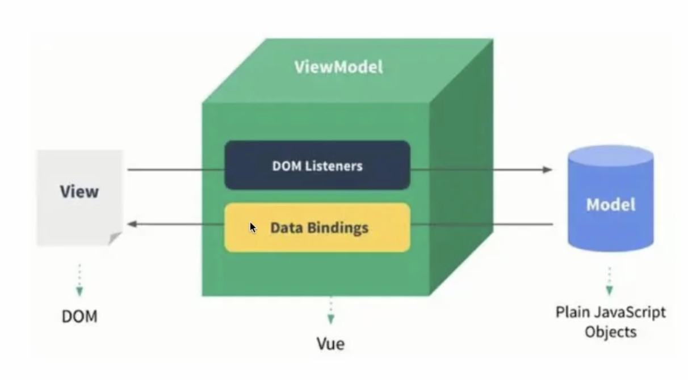
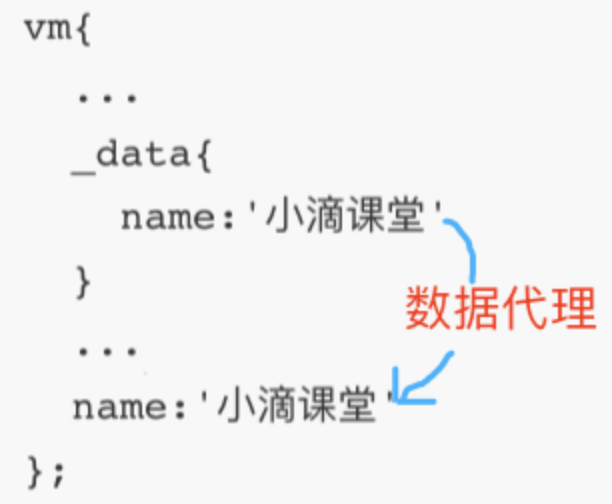
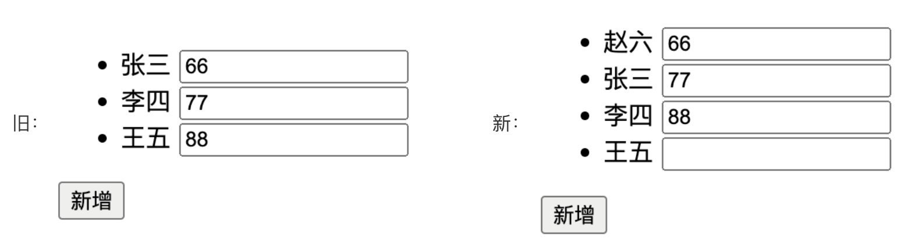
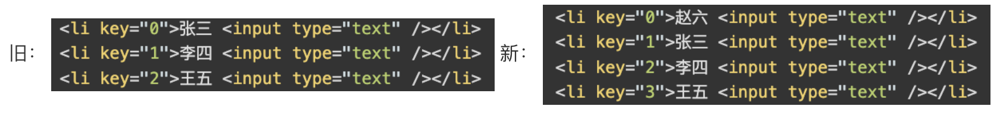
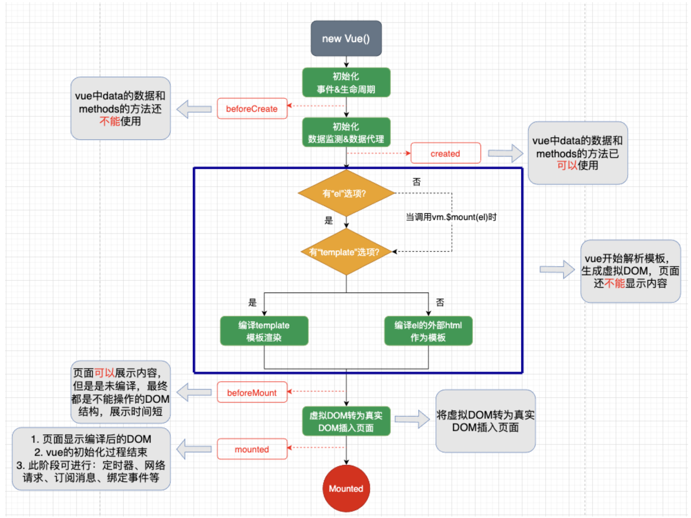
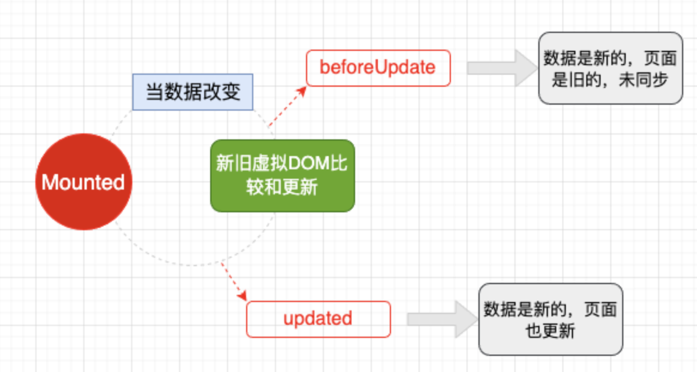
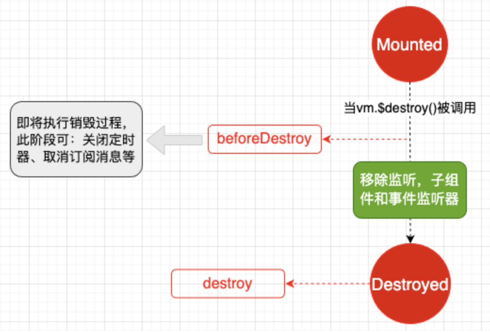

# vue3 学习笔记

##### vue

- 核心功能：

  - 声明式渲染：Vue 基于标准 HTML 拓展了一套模板语法，使得我们可以声明式地描述最终输出的 HTML 和 JavaScript 状态之间的关系。

  - 响应性：Vue 会自动跟踪 JavaScript 状态并在其发生变化时响应式地更新 DOM。vue 使用虚拟 DOM+Diff 算法，只更新变化的 DOM 节点，复用不变的 DOM 节点。

- 单文件组件
  Vue 的单文件组件会将一个组件的逻辑 (JavaScript)，模板 (HTML) 和样式 (CSS) 封装在同一个文件里。单文件组件 (Single-File Components) 是 Vue 的标志性功能。

- 选项式 API 和组合式 API

  - 使用选项式 API，我们可以用包含多个选项的对象来描述组件的逻辑，例如 data、methods 和 mounted。选项所定义的属性都会暴露在函数内部的 this 上，它会指向当前的组件实例。选项式将响应性相关的细节抽象出来，并强制按照选项来组织代码，从而对初学者而言更为友好。
    ```js
    <script>
    export default {
      // data() 返回的属性将会成为响应式的状态，并且暴露在 this 上
      data() {
        return {...}
      },
      methods: {...},
      mounted() {...}
    }
    </script>
    ```
  - 组合式 API 的核心思想是直接在函数作用域内定义响应式状态变量，并将从多个函数中得到的状态组合起来处理复杂问题。这种形式更加自由。

    ```html
    <script setup>
      import { ref, onMounted } from 'vue';

      const count = ref(0);
      function increment() {
        count.value++;
      }
      onMounted(() => {
        console.log(`The initial count is ${count.value}.`);
      });
    </script>
    ```

- MVVM
  
  所以实例化的 Vue 一般被称作 VM，即 ViewModel。

  ```js
  let vm = new Vue({
    el: #app,
    data: {......}
  })
  ```

- 数据代理（难） （可以去官方文档找找）

  - 原理：使用 Object.defineProperty()通过一个对象代理另一个对象属性的读写

  ```js
  Object.defineProperty('目标对象', '代理属性', {
    get() {             //当读取’目标对象‘的’代理属性‘时，getter就会被调用，且返回代理属性的值
      return ......;
    },
    set(value) {        //当修改’目标对象‘的’代理属性‘时，setter就会被调用，且收到修改的值
      ......;
    },
  });
  ```

  - 实现
    
    通过 Object.defineProperty()把 data 中的属性添加到 vm 对象上，每个属性都有 setter/getter。通过 vm 对象代理 data/\_data 中属性的读写。
    比如`{{msg}}`而不是`{{vm.msg}}`，更加方便的读写 vue 中 data 的数据。

- 被 vue 管理的函数都应写成普通函数。不被 vue 管理的（定时器，ajax 回调函数，promise 回调函数）最好写成箭头函数。（没有完全理解）

##### v-on

- 阻止默认事件
  **js** 中的阻止默认事件

  ```html
  <a herf="https://......" @click="func">跳转</a>
  <script>
    methods:{
      func(event){
        event.preventDefault()
      }
    }
  </script>
  ```

  **vue** 中的阻止默认事件

  ```html
  <a herf="https://......" @click.prevent="func">跳转</a>
  <script>
    methods:{
      func(){
        ......
      }
    }
  </script>
  ```

- 阻止事件冒泡
  如果不用@click.stop，那么点击这个 a 标签将触发两次 func 函数，也就是事件冒泡。.stop 和.prevent 可以连用。

  ```html
  <div @click="func">
    <a herf="https://......" @click.stop="func">跳转</a>
    <a herf="https://......" @click.stop.prevent="func">跳转</a>
  </div>
  <script>
    methods:{
      func(){
        ......
      }
    }
  </script>
  ```

- 只触发一次事件
  `@click.once="func"`只有第一次点击标签会触发，后面再点就没用了。

- 键盘事件
  `@keyup.enter="showMessge"`点击回车触发。

##### class 样式的动态绑定

```css
.bg {
  background-color: red;
}
.fs {
  font-size: 30px;
}
```

- 字符串写法

  ```html
  <div :class="bg">小滴课堂</div>
  ```

- 对象写法

  ```html
  <div :class="obj">小滴课堂</div>
  obj:{bg: true, fs: true}
  ```

- 数组写法

  ```html
  <div :class="list">小滴课堂</div>
  list:['bg', 'fs'] //数组中是字符串
  ```

- 也可以搞点花样（下面两种写法等价）

  ```html
  <div :class="[trueOrFalse? classA:'', classB]" />
  <div :class="[{classA: trueOrFalse}, classB]" />
  ```

##### style 样式的动态绑定

不用 vue 的写法`<div style="font-size:30px; color:blue;" />`
用 vue 的写法`<div :style="{fontSize:'30px',color:'blue'}" />`，将 css 变成对象。

##### 条件渲染

- v-if v-else-if v-else
  不展示时直接移除 DOM 元素，适合切换频率低的场景
  需要连用，中间不能放其他标签。
- v-show
  不展示时使用样式隐藏，适合切换频率高的场景

一般来说，v-if 有更高的切换开销，而 v-show 有更高的初始渲染开销。
如果需要非常频繁地切换，则使用 v-show 较好；如果在运行时条件很少改变，则使用 v-if 较好。

##### 列表渲染

- v-for 遍历数组
  使用 item in items 形式的特殊语法（也可以 in 换成 of），其中 items 是源数据数组，而 item 则是被迭代的数组元素的别名。
  `<li v-for="(item,index) in list">{{item.name}}-{{index}}</li>`

- 遍历对象
  三个参数为：值 键名 索引
  `<li v-for="(value,name,index) in obj">{{index}}：{{name}}：{{value}}</li>`

##### 维护状态 key 的作用和原理

`<li v-for="(item,index) in list" :key="index">{{item.name}}<input type="text" /></li>`

- 添加赵六进入数组`list.unshift({name:'赵六'})`。通过观察后方的 input 可以看出，前三个 li 标签没有变化，他们还是之前的 DOM 节点，只不过其中的内容变了。由第二张图可以看出，DOM 加入了新 li 节点 key=4，前三个节点没有变。
  
  
- 为了给 Vue 一个提示，以便它能跟踪每个节点的身份，从而重用和重新排序现有元素，你需要为每项提供一个唯一 key。改成下面的写法，给每个对象加一个 id，就能让 vue 明白每个节点的身份。
  `<li v-for="(item,index) in obj" :key="item.id">{{item.name}}</li>`
  ```js
  obj: [
      { name: '张三', id: '1' },
      { name: '李四', id: '2' },
      { name: '王五', id: '3' },
    ],
  ```
  - key 值使用 index，或者不加 key 值，在数组元素顺序打乱时，会产生不必要的 DOM 更新以及界面效果出问题。
  - key 主要用在 Vue 虚拟 DOM（类似 js 对象格式的数据） 的 Diff 算法，新旧虚拟 DOM 对比，复用不变的旧节点，渲染改变的节点，提高渲染速度

##### 数据的更新问题

- 通过普通对象添加属性方法，Vue 不能监测到且不是响应式。
  下面的例子中，obj.age 渲染不出来，应该使用以下两种方法。

  ```js
  {{obj.name}}  {{obj.age}}
  obj:{name:'wzt'}
  add(){
    this.obj.age= '23';
    this.$set(this.obj,'age','22');
    Vue.set(this.obj,'age','22');
  }
  ```

- 直接通过数组索引值改变数组的数据，Vue 监测不到改变。因为在 vue 中数组并没有跟对象一样封装有监测数据变化的 getter、setter。如果写成`this.list[0].name = 'zcl'`是可以的，但是写成`this.list[0] = { name: '李四',age: 20 };`vue 监测不到。
  Vue 在数组的原始操作方法（js 提供的）上包裹了重新解析模板的方法（vue 封装过的）。这 7 个函数会改变原数组，因此他们被封装过。其他不改变原数组的函数就没必要封装了，例如 filter()。
  push() pop() shift() unshift() splice() sort() reverse()

##### 其他 v- 指令

- v-text `<p v-text="name">123</p>`
  有点类似{{}}，在所在节点渲染文本内容，但是会替换节点中现有的内容（例子中的 123）
- v-html `<p v-html="str"></p>`
  str 字符串里写的是 html，在所在节点渲染 html 结构的内容，替换节点所在的所有内容。在网站上动态渲染任意 HTML 是非常危险的，因为容易导致 XSS 攻击（注入恶意指令代码到网页）。

##### main.js

项目的主入口文件 src/main.js

```ts
//根据传入的组件生成一个对应的vue实例
import { createApp } from 'vue';
//所有组件的父级组件
import App from './App.vue';

//将实例对象挂载到指定标签下
createApp(App).mount('#app');
```

##### App.vue

```ts
<template>
  <!-- vue2组件html模板中必须有一个根标签<div/>，vue3中可以没有 -->
</template>
<script lang="ts">
//defineComponent根据传入的配置对象，生成对应的组件
import { defineComponent } from 'vue';
//生成组件并暴露出去
export default defineComponent({
  //组件名称
  name: 'App',
  //注册子组件
  components: {
    HelloWorld,
  },
});
</script>
```

##### setup()

&emsp;&emsp;新的组件选项，在创建组件实例时，在 beforeCreate 之前执行(一次)。setup 方法是在 components, props, data, Methods, Computed, Lifecycle, methods 之前执行。此组件对象还没有创建,this 是 undefined。可以通过 getCurrentInstance 这个函数来返回当前组件的实例对象，也就是当前 vue 这个实例对象。
`const {proxy}:any = getCurrentInstance();`

```ts
//如果在setup中返回值是一个对象，对象中的属性或方法，模版中可以直接使用
setup(){
  const msg:string='BJUT';
  return{
    msg
  }
}
```

&emsp;&emsp;setup()的返回值一般都返回一个对象：为模版提供数据，也就是模版中可以直接使用此对象中的所有属性方法。
返回对象中属性会与 data 函数返回对象的属性合并为组件对象的属性。返回对象中的方法会与 methods 中的方法合并成功组件对象的方法。

##### ref 自动获取焦点

ref 响应式类型是任意类型。这是它与 reactive 的明显区别。

```ts
//接受一个内部值并返回一个响应式且可变的 ref 对象。
const msg=ref('xdclass');
//通过 val.value方法返回的这个ref对象中的值
console.log(val.value);
//在模版中使用
//直接使用val即可，
<template>{{val}}<template/>
```

```ts
//自动获取焦点
<template>
  <input type="text"><br>
  <input type="text" ref="inputRef">
</template>

setup(){
    const inputRef=ref<HTMLElement|null>(null)
    onMounted(()=>{
        inputRef.value && inputRef.value.focus();
    })
    return{
        inputRef
    }
}
```

##### reactive

`const proxy=reactive(obj)`接收一个普通对象然后返回该普通对象的响应式代理器对象。
​ 响应式转换是“深层的”：会影响对象内部所有的嵌套的属性。

##### setup 的参数

props：是一个对象，里面有父级组件向子级组件传递的数据，并且是在子级组件中使用 props 接收到的所有属性，并且获取到的数据将保持响应性。
context
attrs：它是绑定到组件中的 非 props 数据，并且是非响应式的。
emit：vue2 中的 this.$emit();
slot：是组件的插槽，同样也不是响应式的。

##### 生命周期钩子函数

创建---挂载---更新---销毁


1. 如果在 beforeCreate()中 console.log(this)，得到的结果不一定是真实的。console.log(this)可能是在其他时期执行的。在后面写一个`debugger;`可以解决这个问题。
2. 在 beforeMount 阶段页面可以展示内容，但是是未编译。比如直接显示为`{{var}}`这个样子。此时可以操作 DOM，但是操作其实并未实际生效。因为操作会在虚拟 DOM 转为真实 DOM 的过程中被覆盖。
3. 如果没有 el 选项时，需要使用 vm.$mount(el)。el 选项就是下面这个东西。
   脚手架创建的项目的这行代码中，mount('#app')应该也是这个用途。`app.use(store).use(router).use(vant).mount('#app');`
   ```js
   var app = new Vue({
     el: '#app',
     data: {...},
   });
   ```




beforeDestroy 时，数据、方法可以访问但是不触发更新。

```ts
setup(){  //vue3的生命周期函数写在setup中，比vue2的生命周期函数先执行
  onBeforeMount(() => {});
  onMounted(() => {});
  onBeforeUpdate(() => {});
  onUpdated(() => {});
  onBeforeUnmount(() => {});
  onUnmounted(() => {});
}
```

##### computed

```ts
<template>
  <input type="text" v-model="first" /><br />
  <input type="text" v-model="second" /><br />
  <input type="text" v-model="addUp" /><br />
</template>
setup() {
    const first = ref<string>('');
    const second = ref<string>('');
    // const addUp = computed(() => {  两种写法皆可
    //   return first.value + second.value;
    // });
    const addUp = computed({
      get() {
        return first.value + second.value;
      },
      set(val) {
        first.value = val;
        second.value = val;
      },
    });
    return {first,second,addUp};
  },
```

当只读时可以简写

```ts
const addUp = computed(() => {
  return first.value + second.value;
});
```

计算属性优点：有缓存的机制，可以复用，效率高，调试方便。
有多个地方使用同一个计算属性，当值改变时，计算属性有缓存的机制，只会更新一次。

##### watch 监视器

```ts
const obj = reactive({
  name: 'Oscar',
  courses: ['ssm', 'javase', 'springboot'],
});
//watch:第一个参数监视源(可以是一个数组，表示监视多个)
//第二个参数回调函数
//第三个参数watch配置项(immediate和deep)
//其中，immediate表示obj在值在初始化的时候也执行回调函数
watch(
  obj, //也可以写成 'obj.name'，一定要写成字符串的形式，不然会报错
  (value) => {
    console.log(value);
  },
  { immediate: true }
);
```

简写

```js
watch:{
  isSunny(){
    this.plan = this.isSunny ? 'go out' : 'stay home';
  },
}
```

##### 对比 computed 与 watch

- vue 的作者认为 watch 会被滥用，监视属性是命令式且重复的。
- 计算属性实现更加简洁明了。因此，两者都能实现的功能，优先选择使用 computed。
- watch 能实现异步调用，computed 不能

例子：使用 watch 和 computed 实现用搜索框 inputValue 搜索列表 list

```js
list: [
  { name: '牛仔裤', price: '88元' },
  { name: '运动裤', price: '67元' },
  { name: '羽绒服', price: '128元' },
  { name: '运动服', price: '100元' },
],
computed: { //定义计算属性newList
  newList() {
    return this.list.filter((i) => {
      //indexOf() 用来查找的元素的位置
      //不包含inputValue的对象的indexOf结果为-1
      return i.name.indexOf(this.inputValue) !== -1;
    });
  },
},
watch:{
  inputValue:{
    immediate:true, //初始化组件时能够执行一次watch，
    //indexOf('')的结果为0，这样就能把整个列表都显示出来
    handler(value)=>{
      this.newList = this.list.filter((i)=>{
        return i.name.indexOf(value) !== -1
      })
    }
  }
}
```

##### provide inject

用来在爷孙组件中传值

```ts
//爷爷组件
setup(){
  const color = ref<string>("yellow");
  provide("color",color);
  function changeColor(val:string){
    color.value = val;
  }
  return {color}
}
//孙子组件
setup(){
  const color = inject("color");
}
```

##### axios 配置

```ts
//axiosConfig.ts 文件
import axios from 'axios';
const http = axios.create({});
http.interceptors.request.use((req) => {
  return req;
});
http.interceptors.response.use((res) => {
  return res;
});
export default http;
```

```ts
//main.ts 文件
const app = createApp(App);
app.config.globalProperties.$http = http;
```

##### mockjs 设置

```ts
import Mock from 'mockjs';
//设置请求延时
Mock.setup({
  timeout: '200-2000',
});
//三个参数 正则表达式url, 请求方法, 请求的回调函数
Mock.mock(/\/api\/test/, 'get', (req: any) => {
  return {
    code: 0,
    data: {
      msg: '测试成功',
    },
  };
});
export default Mock;
```

- 在 main.ts 文件中，根据不同的 import 方式，有两种使用方法。这样 mock 才能被成功导入。

  ```ts
  import Mock from './mock/mockConfig';
  Mock;
  const app = createApp(App);
  ......
  ```

  ```ts
  import './mock/mockConfig';
  const app = createApp(App);
  ......
  ```

##### vue router

- 路由导航守卫 让用户必须登录

  ```ts
  router.beforeEach((to, from, next) => {
    const token = window.sessionStorage.getItem('token');
    if (to.path === '/login') {
      next();
    } else {
      if (token) {
        next();
      } else {
        next('/login');
      }
    }
  });
  ```

- 使用路由引入组件

  ```ts
  {
      path: '/home',
      name: 'Home',
      component: () => import('../components/Home/home.vue'),
      redirect: '/homeTop',
      children: [
        {
          path: '/homeTop',
          name: 'HomeTop',
          component: () => import('../components/Home/top.vue'),
        },
      ],
    },
  ```

- 跳转方式

  ```html
  <van-tabbar-item icon="home-o" to="homeTop">首页</van-tabbar-item>
  ```

  ```ts
  const { proxy }: any = getCurrentInstance();
  proxy.$router.push('/login');
  ```

##### vuex

- 在组件中调用 vuex 中的方法

  ```ts
  import { useStore } from 'vuex';

  const store = useStore();
  function toCart(item: any) {
    store.commit('toCart', item);
    store.commit('getCart');
  }
  ```

- 在 vuex 中存储数据
  mutations 中的函数不会返回值，commit 方法并不会返回 mutations 中写的方法的返回值。它们只接受 state 和 payload（载荷，即传入的参数）作为参数，然后直接修改 state。

  ```ts
  state: {
      cartArray: [],
    },
  mutations: {  //添加商品到购物车
    toCart(state: any, tag: any) {
      const goods: any = state.cartArray.find((item: any) => item.id === tag.id);
      if (goods) {
        goods.count += 1;
      } else {
        const item = {
          id: tag.id,
          img: tag.img,
          title: tag.details,
          count: 1,
        };
        state.cartArray.push(item);
      }
    },  //查询商品
    getCart(state: any) {
      console.log(state.cartArray);
    },
  },
  ```

- getter
  就像计算属性一样，getter 的返回值会根据它的依赖被缓存起来，且只有当它的依赖值发生了改变才会被重新计算
  ```ts
  getGoodsNum(state: any) {
    let num = 0;
    state.cartArray.forEach((item: any) => {
      num += item.count;
    });
    return num;
  },
  ```

##### 打包配置

- vue.config.js
  ```js
  module.exports = {
    publicPath: './',
  };
  ```
- 修改路由为 hash 模式

  ```ts
  import { createRouter, createWebHashHistory } from 'vue-router';
  const router = createRouter({
    // history: createWebHistory(process.env.BASE_URL),
    history: createWebHashHistory(process.env.BASE_URL),
    routes,
  });
  ```

##### vscode 功能用户代码片段

功能用户代码片段是 vscode 中的一个功能。下列代码写在 vue.json 这一文件中，表示它只对 vue 文件生效。输入 prefix 中的变量，即 ts 可以生成下面一段代码。其中的“$1”“$2”代表按下tab后会切换到哪里。“${2:test}”代表选中 test。

```json
"Print to console": {
    "prefix": "ts",
    "body": [
    "<template>",
    "\t<div>",
    "$1",
    "\t</div>",
    "</template>",
    "<script lang=\"ts\">",
    "import {defineComponent} from 'vue';",
    "export default defineComponent({name: '${2:test}',})",
    "</script>",
    "<style scoped>",
    "</style>"
    ],
    "description": "Log output to console",
},
```
