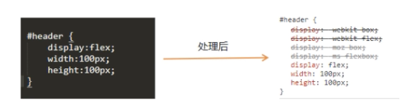

# webpack 学习笔记

##### webpack：js 应用程序的静态模块打包器。

webpack 会将项目的资源文件当成一个一个模块，模块之间会有依赖关系，webpack 将会对这些有依赖关系的文件进行处理，让浏览器能够识别，最后将应用程序需要的每个模块打包成一个或者多个 bundle。 webpack 一般只处理 JavaScript 和 JSON。

##### 开发环境准备

- npm init 创建 package.json 文件
- 安装 webpack

  - 本地安装：（推荐）
    npm install --save-dev webpack
    npm install --save-dev webpack-cli
  - 全局安装：
    npm install --global webpack webpack-cli

- 打包
  默认 entry 入口 src/index.js
  默认 output 出口 dist/main.js

- 打包模式
  按如下设置后，运行 npm run dev 或者 npm run build 来进行打包。
  ```json
  <!-- package.json -->
  "scripts": {
      "dev": "webpack --mode development",
      "build": "webpack --mode production"
  },
  ```

##### webpack.config.js

- 通过配置文件打包

1. path 指文件打包后的存放路径
2. path.resolve()方法将路径或路径片段的序列处理成绝对路径
3. \_\_dirname 表示当前文件所在的目录的绝对路径
4. filename 是打包后文件的名称

```js
const path = require('path');

module.exports = {
  entry: './src/index.js',
  output: {
    path: path.resolve(__dirname, 'build'),
    filename: 'bundle.js',
  },
};
```

- 多入口文件、多出口文件
  ```js
  entry: {
    pageOne: './src/pageOne.js',
    pageTwo: './src/pageTwo.js',
  },
  output: {
    path: path.resolve(__dirname, 'build'),
    filename: '[name].js',  //写成[name]后，就会生成对应的pageOne.js pageTwo.js
  },
  ```

##### webpack dev server

webpack-dev-server 是 webpack 官方提供的一个小型 Express 服务器。使用它可以为 webpack 打包生成的资源文件提供 web 服务。他有两个功能：1. 为静态文件提供 web 服务 2. 自动刷新和热替换(HMR)

配置 webpack.config.js 文件 与 package.json。使用 npm run start 启动服务器。

```js
module.exports = {
  devServer: {
    static: './build', //设置服务器访问的基本目录
    host: 'localhost',
    port: 1234,
    open: true, //自动打开页面
  },
};
```

```json
"scripts": {
    "dev": "webpack --mode development",
    "start": "webpack-dev-server --mode development"
  },
```

##### css-loader

- loader 让 webpack 能够去处理那些非 JavaScript 文件（webpack 自身只理解 JavaScript）。loader 可以将所有类型的文件转换为 webpack 能够处理的有效模块，然后你就可以利用 webpack 的打包能力，对它们进行处理。

```js
module: {
    rules: {
      //test 属性，用于标识出应该被对应的 loader 进行转换的某个或某些文件。
      //use 属性，表示进行转换时，应该使用哪个 loader。
      test: /\.css$/, //正则表达式，表示.css后缀的文件
      use: ['style-loader', 'css-loader'],  //css
      use: ['style-loader', 'css-loader', 'less-loader'],  //less
      use: ['style-loader', 'css-loader', 'sass-loader'],  //sass
    },
  },
```

##### postcss-loader 自动添加浏览器前缀

浏览器前缀：-webkit- -moz- -o- -ms- 代表几种不同的浏览器。有时候他们实现某种样式的差异较大，就需要针对不同浏览器写不一样的 css 代码。


```js
module: {
    rules: {
      test: /\.css$/, //正则表达式，表示.css后缀的文件
      use: [
        'style-loader',
        'css-loader',
        {
          loader: 'postcss-loader',
          options: {
            plugins: [require('autoprefixer')],
          },
        },
      ],
    },
  },
```

```json
"browserlist": ["ie >= 8 ","Firefox >= 20", ...]
```

##### file-loader

- 图片处理
  name：为你的文件配置自定义文件名模板（默认值[hash].[ext]）
  context：配置自定义文件的上下文，默认为 webpack.config.js
  publicPath：为你的文件配置自定义 public 发布目录
  outputPath：为你的文件配置自定义 output 输出目录
  [ext]：资源扩展名
  [name]：资源的基本名称
  [path]：资源相对于 context 的路径
  [hash]：内容的哈希值
  ```js
  module: {
      rules: {
          test: /\.(png|jpg|gif|jpeg)$/, //正则表达式，表示.css后缀的文件
          use: 'file-loader',
      },
  },
  ```
- 字体文件

  ```js
  rules: [
    <!-- css-loader   -->
    {
      test: /\.(ttf|woff|woff2|eot|svg)$/,
      use: [
        {
          loader: 'file-loader',
          options: {
            outputPath: 'fonts/',
          },
        },
      ],
    },
  ];
  ```
