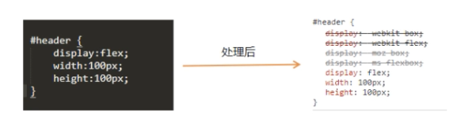
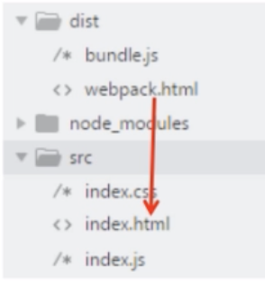
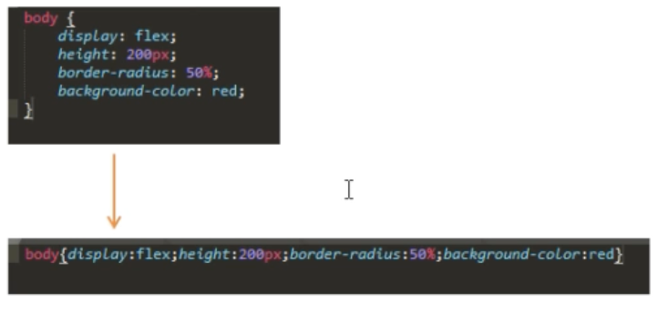
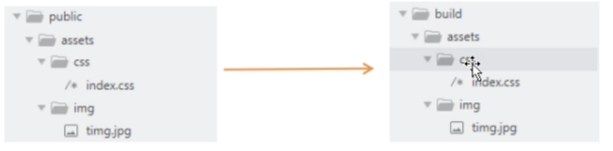
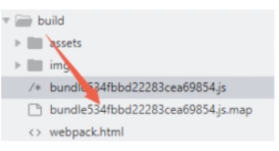

# webpack 学习笔记

##### webpack：js 应用程序的静态模块打包器。

webpack 会将项目的资源文件当成一个一个模块，模块之间会有依赖关系，webpack 将会对这些有依赖关系的文件进行处理，让浏览器能够识别，最后将应用程序需要的每个模块打包成一个或者多个 bundle。 webpack 一般只处理 JavaScript 和 JSON。

##### 开发环境准备

- npm init 创建 package.json 文件
- 安装 webpack

  - 本地安装：（推荐）
    npm install --save-dev webpack
    npm install --save-dev webpack-cli
  - 全局安装：
    npm install --global webpack webpack-cli

- 打包
  默认 entry 入口 src/index.js
  默认 output 出口 dist/main.js

- 打包模式
  按如下设置后，运行 npm run dev 或者 npm run build 来进行打包。
  ```json
  <!-- package.json -->
  "scripts": {
      "dev": "webpack --mode development",
      "build": "webpack --mode production"
  },
  ```

##### webpack.config.js

- 通过配置文件打包

1. path 指文件打包后的存放路径
2. path.resolve()方法将路径或路径片段的序列处理成绝对路径
3. \_\_dirname 表示当前文件所在的目录的绝对路径
4. filename 是打包后文件的名称

```js
const path = require('path');

module.exports = {
  entry: './src/index.js',
  output: {
    path: path.resolve(__dirname, 'build'),
    filename: 'bundle.js',
  },
};
```

- 多入口文件、多出口文件
  ```js
  entry: {
    pageOne: './src/pageOne.js',
    pageTwo: './src/pageTwo.js',
  },
  output: {
    path: path.resolve(__dirname, 'build'),
    filename: '[name].js',  //写成[name]后，就会生成对应的pageOne.js pageTwo.js
  },
  ```

##### webpack dev server

webpack-dev-server 是 webpack 官方提供的一个小型 Express 服务器。使用它可以为 webpack 打包生成的资源文件提供 web 服务。他有两个功能：1. 为静态文件提供 web 服务 2. 自动刷新和热替换(HMR)

配置 webpack.config.js 文件 与 package.json。使用 npm run start 启动服务器。

```js
module.exports = {
  devServer: {
    static: './build', //设置服务器访问的基本目录
    host: 'localhost',
    port: 1234,
    open: true, //自动打开页面
  },
};
```

```json
"scripts": {
    "dev": "webpack --mode development",
    "start": "webpack-dev-server --mode development"
  },
```

##### css-loader

- loader 让 webpack 能够去处理那些非 JavaScript 文件（webpack 自身只理解 JavaScript）。loader 可以将所有类型的文件转换为 webpack 能够处理的有效模块，然后你就可以利用 webpack 的打包能力，对它们进行处理。

```js
module: {
    rules: {
      //test 属性，用于标识出应该被对应的 loader 进行转换的某个或某些文件。
      //use 属性，表示进行转换时，应该使用哪个 loader。
      test: /\.css$/, //正则表达式，表示.css后缀的文件
      use: ['style-loader', 'css-loader'],  //css
      use: ['style-loader', 'css-loader', 'less-loader'],  //less
      use: ['style-loader', 'css-loader', 'sass-loader'],  //sass
    },
  },
```

##### postcss-loader 自动添加浏览器前缀

浏览器前缀：-webkit- -moz- -o- -ms- 代表几种不同的浏览器。有时候他们实现某种样式的差异较大，就需要针对不同浏览器写不一样的 css 代码。


```js
module: {
    rules: {
      test: /\.css$/, //正则表达式，表示.css后缀的文件
      use: [
        'style-loader',
        'css-loader',
        {
          loader: 'postcss-loader',
          options: {
            plugins: [require('autoprefixer')],
          },
        },
      ],
    },
  },
```

```json
"browserlist": ["ie >= 8 ","Firefox >= 20", ...]
```

##### file-loader

- 图片处理
  name：为你的文件配置自定义文件名模板（默认值[hash].[ext]）
  context：配置自定义文件的上下文，默认为 webpack.config.js
  publicPath：为你的文件配置自定义 public 发布目录
  outputPath：为你的文件配置自定义 output 输出目录
  [ext]：资源扩展名
  [name]：资源的基本名称
  [path]：资源相对于 context 的路径
  [hash]：内容的哈希值
  ```js
  module: {
      rules: {
          test: /\.(png|jpg|gif|jpeg)$/, //正则表达式，表示.css后缀的文件
          use: 'file-loader',
      },
  },
  ```
- 字体文件

  ```js
  rules: [
    <!-- css-loader   -->
    {
      test: /\.(ttf|woff|woff2|eot|svg)$/,
      use: [
        {
          loader: 'file-loader',
          options: {
            outputPath: 'fonts/',
          },
        },
      ],
    },
  ];
  ```

- 本地导入第三方 js 库处理（也可以 npm 安装）
  ```js
  resolve: {
    alias: {
      JQuery: path.resolve(__dirname, 'public/js/jquery.min.js'),
    },
  },
  plugins: [
    new webpack.ProvidePlugin({
      JQery: "JQery",
    }),
  ],
  ```
  - npm 安装模块

##### babel

babel-loader： 负责 es6 语法转化
babel-core： babel 核心包
babel-preset-env：告诉 babel 使用哪种转码规则进行文件处理

```js
rules: [
  {
    test: /\.js$/,
    exclude: /node_modules/, //不处理node_modules文件夹中的js文件
    use: {
      loader: 'babel-loader',
      options: {
        presets: ['@babel/present-env'],
      },
    },
  },
];
```

##### html-webpack-plugin

HtmlWebpackPlugin 会自动为你生成一个 HTML 文件，根据指定的 index.html 模板生成对应的 html 文件。

在 webpack.config.js 文件中：
`const HtmlWebpackPlugin = require("html-webpack-plugin");`

```js
plugins: [
    new HtmlWebpackPlugin({
      template: './src/index.html',
      filename: 'webpack.html',
      minify: {
        minimize: true, //是否打包为最小值
        removeAttributeQuotes: true, //删除双引号
        removeComments: true, //删除注释
        collapseWhitespace: true, //折叠空行，变成一行
        minifyCSS: true, //压缩内联css，变成一行
        minifyJS: true, //压缩内联js，变成一行
        removeEmptyElements: true, //删除内容为空的html元素
      },
      hash: true, //是否加上hash，默认是 false
    }),
  ],
```

##### 提取分离 css

- 将所有的入口 chunk(entry chunks)中引用的 css，移动到独立分离的 CSS 文件。
- 使用 ExtractTextPlugin 插件以及 mini-css-extract-plugin 插件。

##### 压缩 css 及优化 css 结构



- optimize-css-assets-webpack-plugin 插件
  Plugins：
  - assetNameRegExp: 正则表达式，用于匹配需要优化或者压缩的资源名。默认值是 `/.css$/g`
  - cssProcessor: 用于压缩和优化 CSS 的处理器，默认是 `cssnano`
  - cssProcessorPluginOptions:传递给 cssProcessor 的插件选项，默认为{}
  - canPrint:表示插件能够在 console 中打印信息，默认值是 true
  - discardComments:去除注释

##### 拷贝静态文件



将 public 目录中的静态资源在打包的时候放入打包文件夹 build 中。
使用 copy-webpack-plugin

```js
new CopyWebpackPlugin([
  {
    from: __dirname + '/public/assets',
    to: __dirname + '/build/assets',
  },
]);
```

##### clean-webpack-plugin 清除文件

当我们修改带 hash 的文件并进行打包时，每打包一次就会生成一个新的文件，而旧的文件并没有删除。为了解决这种情况，我们可以使用 clean-webpack-plugin 在打包之前将文件先清除，之后再打包出最新的文件。

##### Devtool SourceMap

- Sourcemap 是为了解决实际运行代码（打包后的）出现问题时无法定位到开发环境中的源代码的问题。
- 一共有 5 种选项：eval、source-map、inline、cheap、module. 详情见https://www.webpackjs.com/configuration/devtool/#root
- source-map 选项会为模块生成独立的 source-map 文件。打包后的模块在模块后面会对应引用一个.map 文件，同时在打包好的目录下会生成相应的.map 文件。
  

```js
devtool:"eval", //js开启
rules: {  //css开启
  test: /\.css$/,
  use: [
    'style-loader',
    {
      loader: 'css-loader',
      options: {
        sourcemap: true,
      },
    },
  ],
},
```

- 开发环境建议使用 cheap-module-eval-source-map。生产环境建议使用 source-map。

##### 模块热替换 HMR

模块热替换(HMR - Hot Module Replacement)功能会在应用程序运行过程中替换、添加或删除模块，而无需重新加载整个页面。主要是通过以下几种方式，来显著加快开发速度：

- 保留在完全重新加载页面时丢失的应用程序状态。
- 只更新变更内容，以节省宝贵的开发时间。
- 调整样式更加快速 - 几乎相当于在浏览器调试器中更改样式。

```js
devServer: {
  static: './build',
  host: 'localhost',
  port: 1234,
  hot: true,    //热替换
  hotOnly: true, //hotOnly表示只有热更新，不会自动刷新页面
},
plugins: [
  new webpack.NamedModulesPlugin(),
  new webpack.HotModuleReplacementPlugin()
];
```

修改 js 文件时代码不会自动热更新，需在 index.js 中加入以下代码可以告诉 webpack 接受更新的模块。

```js
if (module.hot) {
  module.hot.accept();
}
```
