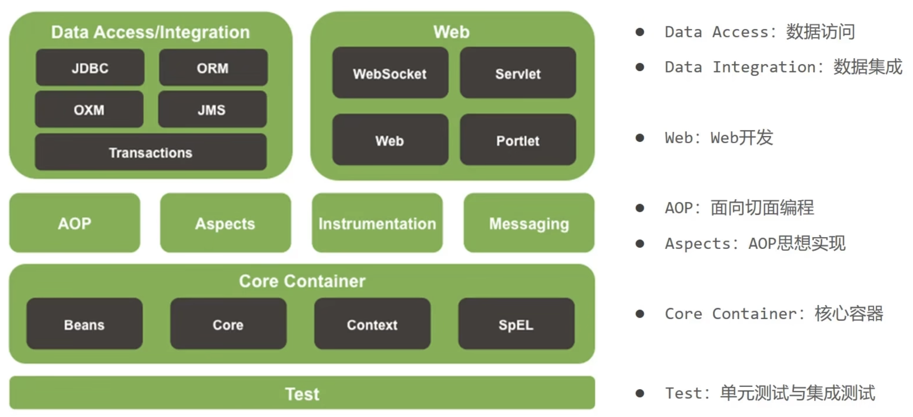

# Spring 学习笔记

## Spring 简介

- 简化开发
- 框架整合 MyBatis...

全家桶：

- Spring Framework
  - 系统架构：
    
- Spring Boot
- Spring Cloud

## IoC & DI

**IoC**(Inersion of Control，控制反转)
**DI** (Dependency Injection，依赖注入)

**反转**是指对象的创建权和对象之间依赖关系的管理权发生了转移。

- 传统写法：在代码中，如果 A 类需要使用 B 类，A 类必须主动去 new 一个 B 类。
- A 类不再主动去 new B 类，而是告诉 Spring：“我需要一个 B”。Spring 容器会在启动时把 B 创建好，然后注入给 A。

```java
@Service
public class UserService {
    // 根本没有 new 关键字
    // 只要加个注解，Spring 就会自动把创建好的对象塞进来
    @Autowired
    private UserDAO userDAO;

    public void save() {
        userDAO.save();
    }
}
```

主要原因是为了**解耦**。如果你的项目里有 100 个地方用到了 UserDAO。

- 不用 IoC：如果你想把 UserDAO 换成 NewUserDAO，你需要修改 100 个文件的 new 代码。
- 用 IoC：你只需要修改 Spring 的配置（或者改一下注解），这 100 个地方自动就变了。

**IoC 容器**负责管理应用程序中的对象（称为 bean）的生命周期和配置。

**DI**：在 IoC 容器中将有依赖关系的 Bean 进行关系绑定

#### IoC 入门案例

1. 创建配置文件

```xml
<Beans>
    <!-- 首先 Maven 导入 spring-context -->
    <Bean id="bookDao" class="com.bjut.dao.impl.BookDaoImpl"></Bean>
    <Bean id="bookService" class="com.bjut.service.impl.BookServiceImpl"></Bean>
</Beans>
```

2. 获取 IoC 中的 Bean

```java
public static void main(stringargs) {
    // 获取IoC容器
    ApplicationContext ctx = new classPathXmlApplicationcontext("applicationcontext.xml");
    // 用id获取bean
    BookDao bookDao =(BookDao)ctx.getBean("bookDao");
    bookDao.save();
}
```

#### DI 入门案例

```java
public class BookServiceImpl implements Bookservice {
    // 删除业务层中使用new的方式创建的dao对象
    private BookDao bookDao;

    public void save() {
        bookDao.save()
    }
    // 提供对应的set方法，容器会调这个方法
    public void setBookDao(BookDao bookDao){
        this.bookDao = bookDao;
    }
```

```xml
<bean id="bookDao" class="com.bjut.dao.impl.BookDaoImpl"/>
<bean id="bookService" class="com.bjut.service.impl.BookServiceImpl">
    <!-- 配置server与dao的关系 -->
    <!-- name表示配置哪一个对象，ref代表参照哪一个Bean -->
    <property name="bookDao" ref="bookDao"/>
</bean>
```

### 实例化（instantiate） Bean

scope 属性：

- singleton 默认 单例
- prototype 非单例
  `<Bean id=".." class=".." scope="prototype"/>`

1. 提供空参数的构造函数
   不管构造函数是 public 还是 prvate，spring 都能调用
2. 用**静态工厂**

```java
public class orderDaoFactory {
    public static OrderDao getOrderDao(){
        // ...初始化...
        return new orderDaoImpl();
    }
}
```

让 spring 知道得到的 Bean 不是 orderDaoFactory 类的对象，而是 getOrderDao 方法的返回值类的对象

```xml
<Bean id="orderDao" class="...orderDaoFactory" factory-method="getOrderDao"/>
```

3.

## Beans POJO DTO VO Entity

- JavaBean

  - 必须有一个公共的无参构造函数 (public no-arg constructor)。让框架能够通过反射机制（Reflection）使用 Class.newInstance() 实例化对象。
  - 属性必须私有化 (private)。通过公共的 Getter 和 Setter 方法访问属性。
  - 实现 java.io.Serializable 接口（可选，但通常建议）。
  - 被用作 **DTO**（Data Transfer Object，数据传输对象）或 **VO**（View Object，视图对象），用于在数据库、逻辑层和前端页面之间传递数据。

- POJO（Plain Ordinary Java Object）
  - 指最普通的 Java 对象，没有任何继承限制，也不一定要遵守 JavaBean 的规范。
- Entity
  - 与数据库表一一对应的类，它的对象代表数据库中的一行数据。
  - 生命周期：它的数据是持久化的（Persistent），意味着它最终会被保存到数据库里，或者从数据库里读取出来。
  - @Entity 注解
