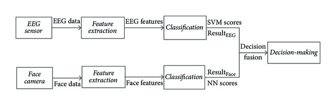
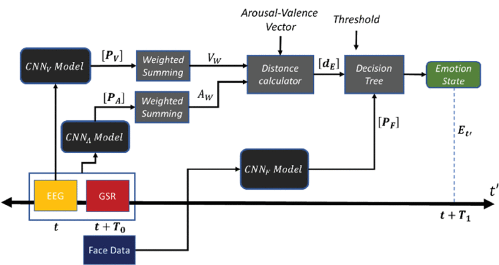

# 学习笔记\_王在田

### Fusion of Facial Expressions and EEG for Multimodal Emotion Recognition

作者单位：华南师范大学，软件学院
时间：2017.9
发表于：https://www.hindawi.com Computational Intelligence and Neuroscience （sci 中科院四区）（已停刊）
被引用：108
数据集：私人数据集
多模态：EEG + facial expression

1. **EEG:** SVM 分类器（机器学习、有监督学习）(happiness, neutral, sadness, and fear)(strong, ordinary, and weak)
2. **facial expression:** 前馈神经网络分类器 (happiness, neutral, sadness, and fear)
3. **fusion:** a sum rule or a production rule
    1. sum rule: calculate the sum of the face expression classifier scores S~1~ and EEG classifier scores S~2~. 2. production rule: 下图中的 P(r~1~,r~2~)中的 r~1~来自表情识别，r~2~来自 EEG
   

### Cross-Subject Multimodal Emotion Recognition Based on Hybrid Fusion

作者单位：Loughborough University London
时间：2020.9
发表于：IEEE Access（sci 中科院三区）
被引用：79
数据集：训练时使用公开数据集 Cohn-Kanade+人脸数据集、Radboud Faces 数据库、FacesDB 和 AffectNet。测试时使用公开数据集 LUMED-2 和 DEAP（多模态情感数据集）
多模态：facial expressions, galvanic skin response (GSR) and electroencephalogram (EEG)

1. **facial expression:** InceptionResnetV2
2. **GSR(皮肤电反应)+EEG:** InceptionResnetV2
3. **EEG:** InceptionResnetV2
4. **fusion:** 来自表情识别的[P~F~]向量值如果超过了预先设定的阈值 0.9，则采信[P~F~]中的最大情绪。如果没有超过阈值，则比较[P~F~]向量中前两位的情感与 valence-arousal 的距离。
   

有意思的句子：
1.We consider not only the dominant emotion (i.e., the one with the maximum probability), but also the emotion with the second highest probability.
