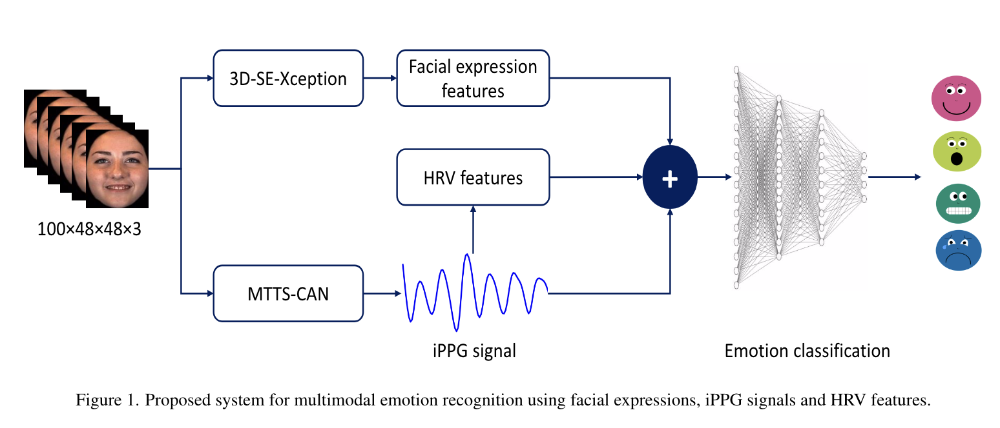

# 学习笔记\_王在田

### Fusion of Facial Expressions and EEG for Multimodal Emotion Recognition

作者单位：华南师范大学，软件学院
时间：2017.9
发表于：https://www.hindawi.com Computational Intelligence and Neuroscience （sci 中科院四区）（已停刊）
被引用：108
数据集：私人数据集
多模态：EEG + facial expression

1. **EEG:** SVM 分类器（机器学习、有监督学习）(happiness, neutral, sadness, and fear)(strong, ordinary, and weak)
2. **facial expression:** 前馈神经网络分类器 (happiness, neutral, sadness, and fear)
3. **fusion:** a sum rule or a production rule
    1. sum rule: calculate the sum of the face expression classifier scores S~1~ and EEG classifier scores S~2~. 2. production rule: 下图中的 P(r~1~,r~2~)中的 r~1~来自表情识别，r~2~来自 EEG
   

### Cross-Subject Multimodal Emotion Recognition Based on Hybrid Fusion

作者单位：Loughborough University London
时间：2020.9
发表于：IEEE Access（sci 中科院三区）
被引用：79
数据集：训练时使用公开数据集 Cohn-Kanade+人脸数据集、Radboud Faces 数据库、FacesDB 和 AffectNet。测试时使用公开数据集 LUMED-2 和 DEAP（多模态情感数据集）
多模态：facial expressions, galvanic skin response (GSR) and electroencephalogram (EEG)

1. **facial expression:** InceptionResnetV2
2. **GSR(皮肤电反应)+EEG:** InceptionResnetV2
3. **EEG:** InceptionResnetV2
4. **fusion:** 来自表情识别的[P~F~]向量值如果超过了预先设定的阈值 0.9，则采信[P~F~]中的最大情绪。如果没有超过阈值，则比较[P~F~]向量中前两位的情感与 valence-arousal 的距离。
   

有意思的句子：
1.We consider not only the dominant emotion (i.e., the one with the maximum probability), but also the emotion with the second highest probability.

### Video-Based Multimodal Spontaneous Emotion Recognition Using Facial Expressions and Physiological Signals

时间：2022
发表于：CVPR(Conference on Computer Vision and Pattern Recognition)
被引用：8
多模态：facial expressions, physiological signals(HRV)

In this paper the physiological parameters are measured from facial video recordings based on imaging photoplethysmography(iPPG) principal.

1. **facial expression:** networkXception
2. **Physiological Signals:** imaging photoplethysmography(iPPG)
3. **fusion:** 来自表情识别的[P~F~]向量值如果超过了预先设定的阈值 0.

Most existing studies have examined the use of facial expressions and physiological cues separately[12, 24, 31,38, 49]. However, little attention has been paid to a fusion between these two modalities[8, 18, 51].

## VLP(Vision-and-Language Pre-training)领域的论文：

### Learning transferable visual models from natural language supervision (CLIP)

作者单位：Open AI
时间：2021
被引用：8703

### An Image is Worth 16x16 Words: Transformers for Image Recognition at Scale (VIT)

作者单位：Google
时间：2020
被引用：22968

patch embedding + position embedding
从 BERT 中借鉴来的分类字符 cls。我们认为他能够从别的 embedding 中学到有用的信息，从而只需要根据他的输出做一个最后的判断。

### ViLT: Vision-and-Language Transformer Without Convolution or Region Supervision

时间：2021
被引用：874

&emsp;&emsp;ViLT 提出了一个极其简单的做多模态学习的框架结构。他把模态的特征抽取做到了极小化，把主要的计算量都放在了后面的模态融合中，大大提高了模型的推理速度。它的主要工作，是将目标检测从多模态学习的框架中给移除了。

&emsp;&emsp;ViLT 一上来先展示了过去的方法都是怎么做的。他们一般在文本模态的处理极其简单，只做一个词嵌入。而图像方面则不然。他们要先过一遍 CNN 网络，再抽取区域性的特征，相当于做了目标检测的任务。这样做的缺点体现在时间中，视觉的时间占了 885/900ms，文本只占 15ms。而 VILT 使视觉的时间缩小到了 0.4ms，作为本文最大的卖点，同时它的准确度也没有掉太多。ViLT 写的有点综述的味道，在相关工作部分介绍的非常多，适合用来了解多模态学习。

that simply extracting input features requires much more computation than the multimodal interaction steps. 在单个模态花费的精力大多，而忽视了模态的融合。

To be fed into VLP models, image pixels need to be initially embedded in a dense form alongside language tokens.
不能把图像的像素丢给 transformer（序列太长）。因此要把图像的像素变化成语义化、离散化的特征。VIT(vision transformer)把图像分成 16\*16 的 patch。VIT 之前，大部分 VLP 的工作，靠的是目标检测（计算量太大）。

single-stream approaches / dual-stream approaches
1：用一个模型处理两个输入，将两个序列直接连接(concatenation)。不管他们直接怎么交互，transformer 直接学。
2：两个模型先各自对各自的模态进行学习，最后融合。
dual-stream approaches 在准确率上只是稍微好一些，但是计算量更大，可以说他们半斤八两。

灰色的表示属于哪个模态，绿色表示文字的位置，紫色表示图像的顺序。
image text matching loss / masked language modeling loss
如果把图像看做文本的话，那么输入全是文本，经过 transformer，最后完形填空，其实就是 NLP 领域的著名文章 BERT。如果不看文字部分其实就是 VIT。

文本小技巧：mask 单词/字母
图像小技巧：图像增强。使用了 RandAugment 方法，但是不用其中的 color inversion 和 cutout，以保证图像和文本还能匹配在一起。

&emsp;&emsp;ViLT 在 VQA NLVR 和 retrieval 这三个下游任务中进行了实验。在时间大大缩短的同时保持了一定程度的准确性。

- Visual Question Answer (VQA) 是对视觉图像的自然语言问答。
- Natural Language for Visual Reasoning（NLVR）：输入图像和描述，输出描述与图像的对应关系是否一致。
- video corpus moment retrieval 任务：在大量的视频中，根据查询语句检索得到相关的片段。

&emsp;&emsp;ViLT 探究了 mask 文本、mask 图片和图像增强对结果的影响。mask 文本的效果十分一般。mask 图像的技术在 ViLT 的时候还不成熟（但在现在 MAE 中已经成熟），所以 ViLT 最终没有采用这种方式。图像增强带来的提升显著。

### ALBUF:Align before Fuse: Vision and Language Representation Learning with Momentum Distillation

时间：2022

MOCO:Momentum Contrast for Unsupervised Visual Representation Learning
AlBUF 分为三个结构。一个是视觉编码器，一个文本编码器，一个多模态编码器。图像进入 transformer encoder，它一共有 N 层。文本进入文本的编码器，它有 L 层。在得到图像和文本之后先做一个 ITC(Image-Text Contrastive Loss)，这个对比学习的 Loss，去把图像文本的特征学好。然后文本特征通过 self attention 层，图像特征通过 cross attention 层，他们之间融合。最后通过 N-L 层的多模态编码器，得到多模态的特征。

### VLMo: Unified Vision-Language Pre-Training with Mixture-of-Modality-Experts

时间：2022

根据下游任务灵活切换。训练的时候是一个模型，推理的时候，根据现在输入的数据，决定应该使用什么样的模型结构
只有一个网络，自注意力层所有模态共享参数，但是在 feed forward 层，每个模态对应自己不同的 expert。

##### 词嵌入 Word Embedding

- 将词汇表中的词语转成固定长度的向量。将 One-Hot 编码表示的高维稀疏向量，转为低维连续的向量。
- 可以表达语义的相似性：
  
- 也可以描述词语之间的语义关联
  
- 词嵌入需要一个训练好的通用的嵌入矩阵
  
- 当需要使用的时候，例如将“我喜欢学习数学”转成矩阵。此时我们先对句子进行切词。然后将得到的词转成 One-Hot 样式的矩阵。最后与词嵌入矩阵相乘，即可得到转化后的矩阵。
  
