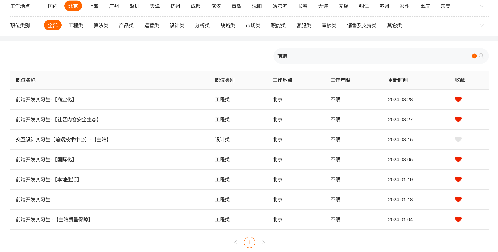

### 基本信息

本科平均 GPA：3.64
北京市物联网软件与系统工程技术研究中心
140525200005246336
CET6 553 2019/06
CET4 566 B+ 2018/12
https://github.com/wwwwwwzt
https://gitee.com/organizations/blind-stick-project/projects
北京工业大学信息学部学习优秀奖学金：本科时期专业排名前 10%的奖学金
考研复试第一名：在考研复试中，得到 87.68 分，排名专业第一。
北京工业大学 2022 学年研究生二等学业奖学金：研究生第一学年的奖学金。

作为一名前端实习生，我热爱编程，并对前端开发充满激情。我具备良好的学习能力和动手能力，能够快速适应新环境和技术。我有良好的团队合作和沟通能力，能够与其他团队成员紧密合作，共同完成项目。我注重细节，对用户体验有着敏锐的观察力和独特的设计理念。我希望成为贵公司的前端实习生，将我的技能和激情投入到工作中，为公司的发展贡献我的力量。

我对前端开发充满激情。我具备良好的学习能力，能够快速适应新环境和技术。我善于与人沟通，共事过的合作对象都对我评价很高。在工作中，我十分谨慎，喜欢深思熟虑、慢工出细活。我希望成为贵公司的前端实习生，将我的技能和激情投入到工作中，证明我的价值。

智慧盲杖出行平台旨在辅助视力残障人士出行，为他们提供必要信息。我们制作了带有传感器的手柄，连接在视障人士的手杖上。手杖将信息传入用户的手机中，并通过盲杖应用发送到服务器上。视障人士的家属可以通过盲杖网页端获取视障人士的状态。

### 中国银行

03/29
https://campus.chinahr.com/pages/2024-boc-spring/#/jobs

### 中国工商银行 总行本部暑期实习生

03/29
https://job.icbc.com.cn/icbc/trmo/d/pc/index.html#/main/internship/home/post

### 中信百信银行

03/29
https://bxyh2024.nowcoder.com/campus-recruitment/aibank/72231/#/candidateHome/applications

### 美团

内推码：tqoWEOH from 牛客网; TCRPH6G from 美团到店餐饮 HR; FK3ATY6 from 张仰

##### 【转正实习】软件开发工程师-前端&移动端方向

微信：美团到店餐饮 HR
https://zhaopin.meituan.com/web/delivery-confirm?jobUnionId=2309762897&jobShareType=1&highlightType=campus&token=21781ea344e64ee49ce6c2b3b28de52c

##### 美团充电宝业务部

03/30
https://zhaopin.meituan.com/web/position/detail?jobUnionId=2336984665&highlightType=campus

##### 基础研发平台

03/30
https://zhaopin.meituan.com/web/position/detail?jobUnionId=2280578461&highlightType=campus

##### 到餐商家产品-前端开发(实习生)

03/30
https://zhaopin.meituan.com/web/position/detail?jobUnionId=2205844647&highlightType=campus

##### 门票度假-项目实习生-Web

03/30
https://zhaopin.meituan.com/web/delivery-confirm?jobUnionId=2347392799&jobShareType=1&highlightType=campus

##### 住宿研发组前端实习生（项目实习生）

03/30
https://zhaopin.meituan.com/web/position/detail?jobUnionId=2346536949&highlightType=campus

### 快手

内推码：jwABqgxSg
专属内推链接：https://campus.kuaishou.cn/#/campus/jobs?code=jwABqgxSg

##### 【暑期实习】前端开发工程师

3/30
https://campus.kuaishou.cn/#/campus/my-apply

##### 日常实习

3/30
https://zhaopin.kuaishou.cn/recruit/e/#/official/trainee/?workLocationCode=Beijing&pageNum=1&name=%E5%89%8D%E7%AB%AF

### 滴滴

3/30
https://app.mokahr.com/apply/didiglobal/6222#/jobs?keyword=%E5%89%8D%E7%AB%AF&location=%E5%8C%97%E4%BA%AC%E5%B8%82&page=1&zhineng=48460&department=%5B208595%5D&commitment=%E5%AE%9E%E4%B9%A0
内推码：NTAW007 from 牛客网

Onboard Infra-前端研发实习生
服务端技术-前端研发实习生
产品研发部--前端研发实习生
前端技术（聚合出行前端）--前端研发实习生
MP Engineering-前端研发实习生

### 淘天

- ~~用户平台 & 阿里妈妈~~ 简历没过
  https://talent.taotian.com/personal/campus-application?lang=zh
- 牛客 HR

### Momenta

4/1
from zqy 小红书
https://www.xiaohongshu.com/explore/660a67f9000000001a0112f7

### 百度

from zzy

##### 电商创新技术组\_AIGC J68561

4/1

### 爱奇艺？

4/1
boss 上看了简历，不知道什么情况
