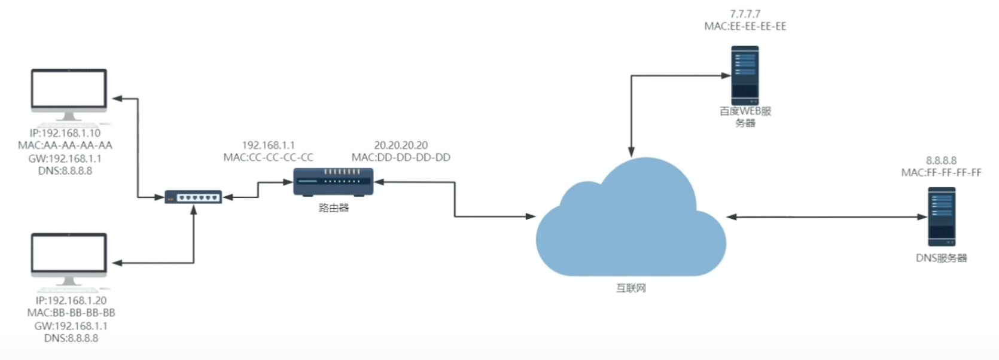
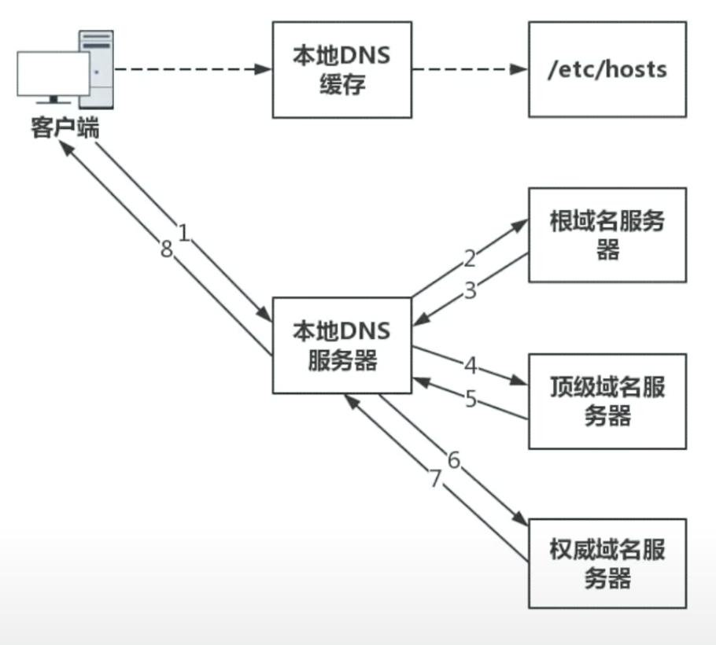
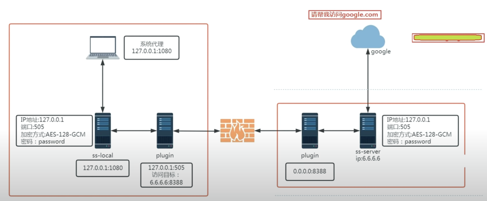
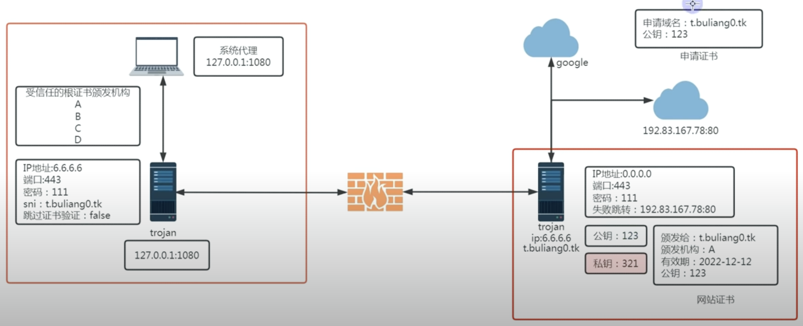

# 计算机网络 学习笔记

## part1

此部分来源于 https://www.youtube.com/watch?v=_618At72evs

**DNS**

1. 查浏览器的本地缓存
2. 查本地 host 文件
3. 电脑中配置的 DNS 服务器

##### step1: 本地

**TCP/IP**
| 层 | 添加的东西 |
| ---- | --------------------------- |
| 应用 | |
| 传输 | 源端口 / 目标端口（DNS 默认为 53） |
| 网络 | 源 ip / 目标 ip | |
| 链路 | 源 MAC 地址 / 目标 MAC 地址 & 校验数据|
| 物理 | |

网络层看目标 ip 地址不在自己的网段范围内，找不到 ip 地址之后，就回去找网关（一般为路由器）
链路层提供 ARP 协议获得网关的 MAC 地址（一般为路由器 LAN 口）

##### step2: 交换机

交换机是个两层设备。它知道数据最好从哪个端口发出去。（加强版集线器）
| 层 | 操作 |
| ---- | ----------------------------------------- |
| 链路 | 查看目标 MAC 地址，把数据转发到对应的端口 |
| 物理 | |

##### step3: 路由器

| 层   | 操作                                                                      |
| ---- | ------------------------------------------------------------------------- |
| 网络 | 替换源 ip 地址和源端口号为 WAN 口 ip 地址和端口，记录在 **NAT** 映射表中  |
| 链路 | 替换源 MAC 地址和目标 MAC 地址为 WAN 口 MAC 地址和下一跳路由器的 MAC 地址 |
| 物理 |                                                                           |

网络层看目标 ip 地址，发现自己附近找不到它，于是将数据包转发到公网其他路由器（下一跳路由器）。

##### step4: DNS 服务器

##### GFW(great firewall)

- DNS 污染（劫持）
  防火墙篡改 DNS 服务器返回的 ip 地址。发生在数据从国际互联网进入国内互联网的时候。
  早期防火墙的 DNS 污染可以通过 hosts 文件来绕过。
- TCP 重置攻击
  用户发送的数据包中的目标 ip 地址或是域名被 GFW 检测到，发现其在黑名单内。将数据包直接干掉或是伪装成目标服务器返回假数据。发生在数据从国内互联网进入国际互联网的时候。
- GFW 能看到数据内容是它进行精确阻断的原因。因此传统 VPN 会对数据加密。但是它加密后的特征非常明显。防火墙虽然看不到内容，但会知道进行了 VPN 连接。

##### ShadowSocks 协议（既加密又特征不明显）

&emsp;&emsp;当浏览器发送请求的时候，会使用代理端口发送请求。请求通过防火墙来到 ShadowSocks 代理服务器。代理服务器再与目标地址通信，并将结果返回给用户。返回结果通过防火墙回到用户的 ShadowSocks 客户端，最后发回给浏览器。
&emsp;&emsp;**重放攻击**：对付 ShadowSocks 服务器，防火墙会发起**主动探测**。来看该服务器是否运行了 ShadowSocks 的服务。它会使用用户发送的数据再给 SS 服务器发一遍。简单的 SS 会被重放攻击探测到。可以引入 plugin 来解决。
&emsp;&emsp;**http plugin** 主要起到流量伪装的作用。它往 SS 请求的字节流前面加上假的 http 请求头，伪装成正常的 http 流量，让防火墙不对其进行重放攻击。出了防火墙后剪掉假的 http 头，再发往 SS 服务器。

&emsp;&emsp;**trojan** 基于 https 的流量伪装。

##### ARP Address Resolution Protocol

IP Address -> MAC Address

- MAC 是设备的物理地址，它独一无二。在局域网间通信的时候，需要使用 MAC 地址。
- 在局域网间通信的时候，它知道目标的 ip 地址，需要知道目标的 MAC 地址。如果本地的 ARP 缓存中没有该信息。ARP 就会向局域网中发送一个 ARP 请求**广播**，询问某个 IP 地址对应的 MAC 地址。如果目标计算机在同一局域网中，并且处于活动状态，则会把自己的 MAC 地址发回。

##### NAT Network Address Translation

私有 IP 地址 <---> 公共 IP 地址
&emsp;&emsp;NAT 用于在不同网络之间转换 IP 地址。它解决了 IPv4 地址短缺的问题，并提供了网络安全性。通过 NAT，多个主机可以共享单个公共 IP 地址，实现网络通信和连接。

## part2

此部分来源于 https://github.com/yuanyuanbyte/Blog?tab=readme-ov-file

### HTTP

##### 特点和缺点

- 特点：无连接、无状态、灵活、简单快速
  - 无连接：每一次请求都要连接一次，请求结束就会断掉，不会保持连接。
  - 无状态：每一次请求都是独立的，请求结束不会记录连接的任何信息，减少了网络开销，这是优点也是缺点。
  - 灵活：通过 http 协议中头部的 Content-Type 标记，可以传输任意数据类型的数据对象(文本、图片、视频等等)，非常灵活。
  - 简单快速：发送请求访问某个资源时，只需传送请求方法和 URL 就可以了，使用简单。正由于 http 协议简单，使得 http 服务器的程序规模小，因而通信速度很快。
- 缺点
  - 无状态：请求不会记录任何连接信息，没有记忆，就无法区分多个请求发起者身份是不是同一个客户端的。意味着如果后续处理需要前面的信息，则它必须重传，这样可能导致每次连接传送的数据量增大。
  - 不安全：明文传输可能被窃听不安全，缺少身份认证也可能遭遇伪装，还有缺少报文完整性验证可能遭到篡改。
  - 明文传输：报文(header 部分)使用的是明文，直接将信息暴露给了外界，WIFI 陷阱就是复用明文传输的特点，诱导你连上热点，然后疯狂抓取你的流量，从而拿到你的敏感信息。
  - 队头阻塞：开启长连接时，只建立一个 TCP 连接，同一时刻只能处理一个请求，那么当请求耗时过长时，其他请求就只能阻塞状态。

##### 报文结构

由请求报文和响应报文组成：

- 请求报文：由请求行、请求头、空行、请求体四部分组成。
- 响应报文：由状态行、响应头、空行、响应体四部分组成。
  - 请求行：包含 http 方法，请求地址，http 协议以及版本。`POST /v1/list HTTP/1.1`
  - 请求头/响应头：就是一些 key:value 来告诉服务端我要哪些内容，要注意什么类型等。
  - 空行：用来区分首部与实体，因为请求头都是 key:value 的格式，当解析遇到空行时，服务端就知道下一个不再是请求头部分，就该当作请求体来解析了。
  - 请求体：请求的参数。
  - 状态行：包含 http 协议及版本、数字状态码、状态码英文名称。`HTTP/1.1 200 OK`
  - 响应体：服务端返回的数据。

##### 常见的请求头、响应头

- 请求头
  Accept、Accept-Charset、Accept-Encoding、Accept-Language:
  浏览器能够处理的内容类型、字符集、压缩编码、当前设置的语言。
  Connection：浏览器与服务器之间连接的类型。
  Cookie：当前页面设置的任何 Cookie
  Host：发出请求的页面所在的域
  Referer：发出请求的页面的 URL
  User-Agent：浏览器的用户代理字符串
- 响应头
  Date：表示消息发送的时间，时间的描述格式由 rfc822 定义
  server: 服务器名称
  Connection：浏览器与服务器之间连接的类型
  Cache-Control：控制 HTTP 缓存
  content-type: 表示后面的文档属于什么 MIME 类型
  Pragma：只有一个属性值，就是 no-cache ，效果和 Cache-Control 中的 no-cache 一致，不使用强缓存

##### 请求方法

- http/1.1 规定了以下请求方法(注意，都是大写):
  GET: 通常用来获取资源
  HEAD: 获取资源的元信息
  POST: 提交数据，即上传数据
  PUT: 修改数据
  DELETE: 删除资源(几乎用不到)
  CONNECT: 建立连接隧道，用于代理服务器
  OPTIONS: 列出可对资源实行的请求方法，用来跨域请求
  TRACE: 追踪请求-响应的传输路径

- GET、POST 区别

  - 从缓存的角度，GET 请求会被浏览器主动缓存下来，留下历史记录，而 POST 默认不会。
  - 从编码的角度，GET 只能进行 URL 编码，只能接收 ASCII 字符，而 POST 没有限制。
  - 从参数的角度，GET 一般放在 URL 中，因此不安全，POST 放在 Request body 请求体中，更适合传输敏感信息。
  - 从**幂等**性的角度，GET 是幂等的，而 POST 不是。(在编程中一个幂等操作的特点是其任意多次执行一个方法所产生的影响均与一次执行的影响相同)
  - 从 TCP 的角度，GET 请求会产生一个 TCP 数据包，把请求报文一次性发出去，而 POST 会分为两个 TCP 数据包。GET 浏览器把 http header 和 data 一起发出去，响应成功 200，POST 先发送 header，响应 100 continue，再发送 data，响应成功 200。(并不是所有的浏览器都会发送两次数据包，Firefox 就发送一次，它的 POST 请求只发一个 TCP 包)

- PUT、POST 区别
  PUT 和 POST 都有更改指定 URI 的语义，但 PUT 被定义为**幂等**的方法，而 POST 则不是，多次调用会产生不同的结果。也就是说：

  - PUT：如果两个请求相同，后一个请求会把第一个请求覆盖掉。（所以 PUT 用来改资源）
  - POST：后一个请求不会把第一个请求覆盖掉。（所以 Post 用来增资源）

- OPTIONS
  主要用途有两个：
  - 获取服务器支持的所有 HTTP 请求方法；
  - 用来检查访问权限。例如：在进行 CORS 跨域资源共享时，对于复杂请求，就是使用 OPTIONS 方法发送嗅探请求，以判断是否有对指定资源的访问权限。

##### HTTP 状态码

1xx: 指示信息——表示请求已接收，继续处理。
2xx: 成功——表示请求成功处理完毕。
3xx: 重定向——表示要完成请求必须进行进一步操作。
4xx: 客户端错误——表示请求有语法错误或请求无法实现。
5xx: 服务端错误——表示服务器未能实现合法的请求。

- **状态码** - **描述**

  - `00` - Continue 客户端应继续其请求
  - `101` - Switching Protocols 服务器根据客户端的请求切换协议。只能切换到更高级的协议。如果服务器同意变更，就会发送状态码 101。
  - `200` - OK 请求成功。通常在响应体中放有数据。
  - `204` - No Content 含义与 200 相同，但响应头后没有 body 数据。
  - `206` - Partial Content 已完成指定范围的请求(带 Range 头的 GET 请求)，场景如 video,audio 播放文件较大,文件分片和断点续传时
  - `301` - Moved Permanently 永久重定向
  - `302` - Found 临时重定向
  - `304` - Not Modified 未修改。所请求的资源未修改，服务器返回此状态码时，不会返回任何资源。可以使用缓存的资源，不用在服务器获取。当协商缓存命中时会返回这个状态码。
  - `400` - Bad Request 请求有语法错误
  - `401` - Unauthorized 没有权限访问
  - `403` - Forbidden 服务器理解请求客户端的请求，但是拒绝执行此请求。这实际上并不是请求报文出错，而是服务器禁止访问，原因有很多，比如法律禁止、信息敏感。
  - `404` - Not Found 请求资源不存在
  - `408` - Request Time-out 服务器等待客户端发送的请求时间过长，超时
  - `500` - Internal Server Error 服务器内部错误，无法完成请求
  - `501` - Not Implemented 表示客户端请求的功能还不支持，无法完成请求
  - `503` - Service Unavailable 请求未完成，因服务器过载、宕机或维护等

- 301 302 区别
  - 301 重定向是网页更改地址后对搜索引擎友好的最好方法，只要不是暂时搬移的情况,都建议使用 301 来做转址。
  - 302 状态码应用的典型场景是服务器页面路径的重新规划。
    常见场景有百度，知乎、简书等等。比如说我们要在百度进入菜鸟教程，搜索出来后有一系列的列表，我们可以选择一个去进行一个点击。点击的那个不会直接进入菜鸟教程，而是先跳转到百度设置的一个临时地址，之后再跳转到菜鸟教程真实的地址。

##### 持久连接

- HTTP 协议的初始版本中，每进行一次 HTTP 通信就要断开一次 TCP 连接。以当年的通信情况，都是进行容量很小的文本传输，所以问题不大。可随着 HTTP 的普及，文档中包含大量图片的情况多了起来。比如，使用浏览器浏览一个包含多张图片的 HTML 页面时，在发送请求访问 HTML 页面资源的同时，也会请求该 HTML 页面里包含的其他资源。因此，每次的请求都会造成无谓的 TCP 连接建立和断开，增加通信量的开销。 **图 1**
  <image src="images/2024-03-31-00-54-00.png" style="zoom:30%;"/> <image src="images/2024-03-31-00-55-14.png" style="zoom:25%;"/><image src="images/2024-03-31-01-08-19.png" style="zoom:30%;"/>
- 为解决上述 TCP 连接的问题，HTTP/1.1 和一部分的 HTTP/1.0 想出了持久连接（HTTP Persistent Connections，也称为 HTTP keep-alive 或 HTTP connection reuse）的方法。持久连接的特点是，只要任意一端没有明确提出断开连接，则保持 TCP 连接状态。**图 2**
- 持久连接的好处在于减少了 TCP 连接的重复建立和断开所造成的额外开销，减轻了服务器端的负载，也使 HTTP 请求和响应能够更早地结束，这样 Web 页面的显示速度也就相应提高了。在 HTTP/1.1 中，所有的连接默认都是持久连接，但在 HTTP/1.0 内并未标准化。

- 管线化（pipelining）**图 3**
- HTTP 管线化是将多个 HTTP request 整批提交的技术，而在传送过程中不需先等待服务端的回应。管线化机制须通过永久连接（persistent connection）完成，仅 HTTP/1.1 支持此技术（HTTP/1.0 不支持），并且只有 GET 和 HEAD 要求可以进行管线化，而 POST 则有所限制。此外，初次创建连接时也不应启动管线机制，因为对方（服务器）不一定支持 HTTP/1.1 版本的协议。

- keep-alive
  HTTP1.0 中默认是在每次请求/应答，客户端和服务器都要新建一个连接，完成之后立即断开连接，这就是短连接。当使用 Keep-Alive 模式时，Keep-Alive 功能使客户端到服务器端的连接持续有效，当出现对服务器的后继请求时，Keep-Alive 功能避免了建立或者重新建立连接，这就是长连接。
  - HTTP1.0 版本默认没有 Keep-alive ，所以要想连接得到保持，必须手动配置发送 Connection: keep-alive 字段。若想断开 keep-alive 连接，需发送 Connection:close 字段；
  - HTTP1.1 规定了默认保持长连接，数据传输完成了保持 TCP 连接不断开，等待在同域名下继续用这个通道传输数据。如果需要关闭，需要客户端发送 Connection：close 首部字段。
  - 开启 Keep-Alive 的优点：
    - 较少的 CPU 和内存的使⽤（由于同时打开的连接的减少了）；
    - 允许请求和应答的 HTTP 管线化；
    - 降低拥塞控制 （TCP 连接减少了）；
    - 减少了后续请求的延迟（⽆需再进⾏握⼿）；
    - 报告错误⽆需关闭 TCP 连接；
  - 开启 Keep-Alive 的缺点：
    - 长时间的 Tcp 连接容易导致系统资源无效占用，浪费系统资源。
