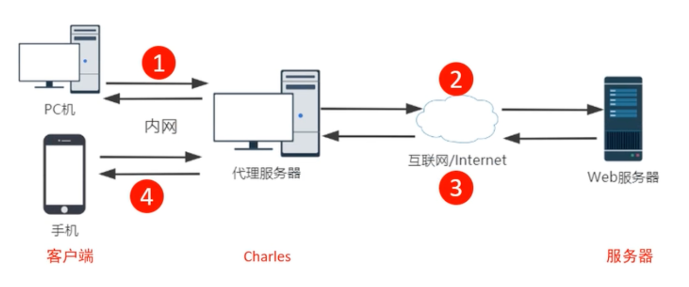
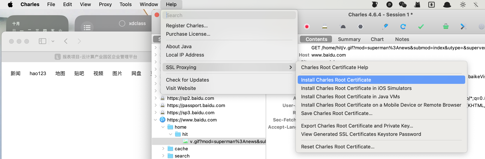
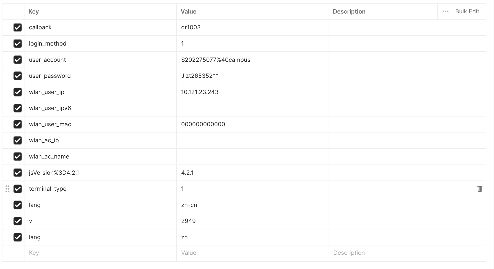
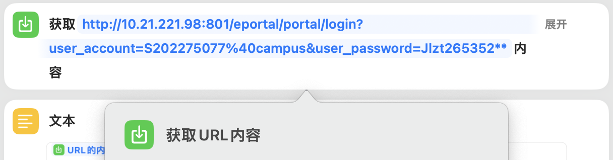
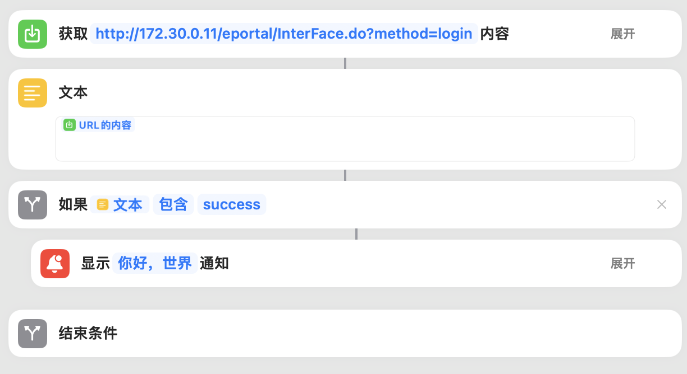

# 基于 macos 的 shortcuts 应用，一键连接中蓝校园网

首先来学习一下抓包工具 charles
https://www.bilibili.com/video/BV1mQ4y1N7dn

- charles 是一个代理服务器。通过成为电脑或是浏览器的代理，来截取请求和请求结果，达到分析抓包的目的。
- 支持流量控制
- 支持接口并发请求
- 支持断点调试
  

https 抓包需要安装 ssl 证书

##### 通过流量配置进行弱网测试

##### 断点调试

&emsp;&emsp;charles 的断点调试功能非常好用。把一个请求打上断点后，他会被留在 charles 服务器这里。我们可以修改它的参数，然后再发送给后端。同样，后端返回的应答也会被留在 charles，也可以被修改。

##### 抓包分析得出的请求参数如下

##### 用 postman 测试得出，参数可以精简为两个

&emsp;&emsp;但是双参数的请求和多参数的请求得到的返回着不同。这是必须的两个参数：http://10.21.221.98:801/eportal/portal/login?user_account=S202275077%40campus&user_password=Jlzt265352**

##### 用 postman 测试得返回值如下：

- 登录成功（多参数、双参数）
  dr1003({"result":1,"msg":"Portal 协议认证成功！"});
  jsonpReturn({"result":1,"msg":"Portal 协议认证成功！"});

- 登录状态下发送请求（多参数、双参数）
  dr1003({"result":0,"msg":"IP: 10.121.23.243 已经在线！","ret_code":2});
  jsonpReturn({"result":0,"msg":"IP: 10.121.23.243 已经在线！","ret_code":2});

- 缺少参数
  jsonpReturn({"result":0,"msg":"无法获取用户认证密码！","ret_code":1});

##### shortcuts

&emsp;&emsp;幸运的事，通过“获取 url 内容”可以发送 http 请求，最终成功登录了中蓝校园网。但是“获取 url 内容”的缺点是：他获得的返回值为文件格式。无论我怎么尝试，它始终只能返回“login”。因此我无法根据返回值做是否登录成功的判断。

最后附上我的思路来源以及他的方法。
https://www.bilibili.com/video/BV1u54y1Z7Ti/

